# NR-03 换手文档 v2：可点击前端演示（整改后复验版）

日期：2026-07-19（v1 同日；v2 为整改后复验提交；v2.1 为 2026-07-20 收尾整改）
任务编号：NR-03
完成状态：整改完成，提交复验（v1 经主线程验收判"整改后复验"，十条意见全部成立并已修复；v2.1 完成复验三项收尾）
上位依据：`docs/next_round_exploration_system_sessions_v1.md`、`docs/exploration_system_information_architecture_v1.md`（含 §12 修订）、`docs/exploration_system_data_contract_v1.md`

## v2.1 收尾整改（对应复验三项）

1. **英文界面中文 UI 残留**：品牌名（中／日／EN）、导航与语言组 aria-label、画布控制 title、
   地图与组织画布 aria-label、地图状态 aria-label 全部进入 `ui_strings.js`；同时按负责人
   批准把界面"演示视图"统一改名为"已核视图"（layer.demo、layer.hint、帮助文案、图例注记）。
2. **A073 与 A002 两条测试拆开**：A073 仅证明"全量 registry 搜索可达"（该 actor 当前
   0 议题／0 事件）；组织→议题→事件→时间链由 A002 等有事件 actor 证明，见下方验证节。
3. **跨路由关闭证据抽屉**：路由改变时清空 drawer selection，旧抽屉不再覆盖新页面。

## v3 组织关系层（2026-07-20，按 `nr3_recheck_and_relation_frontend_brief_v1.md` 实现）

**数据（NR-02 构建模块扩展，`scripts/build_exploration_system_data_v1.py`）**：
类型化集合 `demo/dyadic_relations.json`（14 条 reviewed，两端均解析到 registry actor）、
`demo/aggregate_observations.json`（F027＋R10R029）、`demo/case_roles.json`（27 行）、
`demo/administrative_records.json`（6）、`demo/typed_event_participation.json`（4）、
`demo/relation_leads.json`（恒空）、
`demo/genealogy_anchors.json`（恒空）；`research/candidates.json` 新增
`dyadic_relations`（8 条候选）、`administrative_records`（5）、`relation_leads`
（F012/F013/F034/F035）。F008（rejected duplicate）被排除；构建确定性字节一致；
中央表零改动。claim 分层：supported 13、supported_bounded 15、candidate 13、lead 2、
excluded 1。

**呈现（L0＋L1）**：组织面板新增"与其他组织的关系"区（族色芯片、方向箭头、claim 芯片、
supported_bounded 的已确认／缺口两行、金额语义、来源下钻抽屉）与"其他记录与研究线索"区
（行政记录／汇总观察标"非组织关系边"、线索标"非资助事实"）；组织页新增"议题生态／组织
关系"图形状态，关系画布按族着色、箭头表方向、实线已核／虚线候选、族独立开关、边详情卡，
计数按"已确认 · 有限确认 · 待审"分层，无混合总数。

**控制案例实测**：F021 以 supported＋USD 3,250 直接捐赠进入面板与关系图；F025 以
supported_bounded 进入（金额为空，缺口显示"AWWA allocation、奖学金 recipient 待年报"）；
R10R029 只进 X006 面板的汇总观察区（非组织关系边），不上关系图。

截图：`rel_x001_panel.png`、`rel_x004_panel.png`、`rel_graph_demo.png`、`rel_graph_research.png`。

### Post-merge delta（2026-07-20）

- **中央权威字段**：构建器以
  `15_funding_or_support_edges_sample_v0.csv` 已填的 `claim_status`、
  `confirmed_scope`、`missing_scope`、`graph_eligibility`、`amount_semantics`、
  `reviewed_fields` 等为第一优先；已完成的 HR-033 补充表只补中央空字段，最后才按受控规则
  派生。被负责人
  明确复核为空的字段（如 F025 amount）不得被补充包覆盖。
- **最新数据口径**：registry 保留 122 行历史记录，普通界面只显示 121 active actor；
  A072 为 merged duplicate、`display_status=hidden`，搜索与普通图均不可见。默认 actor—issue
  图为 65 条已核边＋173 条候选边；actor—place 为 53 条已核边＋77 条候选边。AI068 属
  事件限定且明确排除出默认冲绳叙事，不进入已核或研究关系图。strict place—issue 为
  312 条总三元组（65 条双人审＋247 条候选；其中 305 条为 E3+，100 条有正式事件附着）。
- **关系层计数**：43 条中央观察＋R10R029 独立汇总观察＝44 输入；已核层为 14 条组织关系、
  6 条行政记录、2 条汇总观察、4 条事件参与记录、27 条案件角色；研究层为 8 条候选组织
  关系、5 条行政候选、4 条研究线索。F036 只显示为事件参与，F011/F040/F041 同样不派生
  稳定组织关系边。
- **中央关系状态**：43 条中央观察分别为 `human_checked` 18、`human_revised` 8、
  `ai_seeded` 12、`needs_second_source` 2、`needs_local_retrieval` 2、`rejected` 1。
  这些中央状态计数不能替代上述 endpoint／claim／graph gate 后的前端集合计数。
- **前端回归**：组织类别筛选同时作用于议题生态图与组织关系图；`RecordRow` 显示
  amount semantics；女性组织类与 P021 先岛节点有中／日／英标签；案件角色明确标注
  “非协作边”。
- **复现与测试**：

```powershell
python scripts\build_exploration_system_data_v1.py
python -m unittest tests.test_build_exploration_system_data_v1
python -m unittest discover -s tests
cd prototypes\nr3_explorer
npm run build
```

不得把行政记录、汇总金额、事件参与或同案角色计入组织关系；不得把
`supported_bounded` 的金额／期间缺口补成事实；不得让 rejected、duplicate、E0、AI068
或 A072 回到默认展示。

## v2 整改清单（历史验收快照；当前计数以 Post-merge delta 为准）

| 验收意见 | 整改 |
|---|---|
| 地区面板无 episode 入口 | 地区面板新增"相关 episode"区（按地点匹配，含研究层待审），点击直达路径页对应 episode；地图→地点→episode→证据链闭合 |
| 演示层当时只能搜 23 个 actor，17 个 edge-isolated 不可搜 | v2 当时改为全量 122 条 registry 记录可搜；合并 A072 后，当前普通界面为 121 个可见 actor（名称／别名／ID 匹配），A073 仍实测可达 |
| 组织详情无事件列表 | 组织面板新增"事件记录"区（事件名、年份、动作类型），点击跳时间页对应年份；组织→议题→事件→证据链闭合 |
| 比较功能缺失 | 新增两处同字段比较：地区对比（总览面板双列指标与议题）、episode 对比（路径页六阶段并排，TE01↔TE03 实测） |
| 证据抽屉无 locator | 抽屉卡片新增 locator（archive_path，等宽字体） |
| 390px 不可用 | 新增 ≤820px 移动断点：顶栏换行、页面单列、画布定高、路径轨横滚、抽屉全宽；390×844 实测无横向溢出 |
| "13 个已核 episode（含待审）"措辞错误 | 改为"已核 9 ＋ 待审 4 · 11 类路径" |
| 英文证据页残留中文标题／维度名 | D1–D6 维度名进入 `ui_strings.js` 三语表 |
| 地图区域按钮在 aria-hidden 容器内 | 已移除该属性；搜索下拉提供键盘可达的组织选择路径 |
| 换手截图 9 张仅 7 张不同 | 截图流程修正（每次截图前强制刷新重置 SPA 状态）并逐对校验 md5 不同，见下方"页面截图" |
| workbench 把已完成项列为待办、保留已取消的检查点 B | `docs/phase1_workbench.md` 下一步 4–7 条已更新 |

## v2／v2.1 完成项（交付沿革；下列计数已按当前构建口径校正）

- 五个页面全部上线：总览 `#/`、组织 `#/actors`、时间 `#/time`、路径 `#/pathways`、证据 `#/evidence`。
- 总览（V1）：42 市町村 GeoJSON、点选陆地选区、滚轮缩放（以光标为中心）、拖拽平移、区域标签随地理锚定；全域／先岛聚焦两状态；面板含指标、议题入口（跳组织页）、相关 episode（跳路径页）、地点标签；地区对比模式。
- 组织（V2）：65 条已核 actor—issue 边为默认层；普通界面搜索 121 个可见 actor（中央
  provenance 仍保留 122 行，A072 隐藏；搜索含别名与 ID）；类型／议题筛选；节点详情
  （议题、地点、事件记录、身份来源）；画布缩放平移。
- 时间（第五页）：一期方案四个时段节点、12 个已核事件按年组织、参与者跳组织页、组织谱系诚实缺口（0 锚点）。
- 路径（V3）：9 个已核 episode 六阶段阶梯，状态直读数据；episode 六阶段对比；参与组织、来源、关联案件。
- 证据（V4）：六维度 120 个当前生成单元，facet 条形与来源类型×归档矩阵，机制解释面板；
  单元数是生成结果，不是稳定契约。
- 研究视图：已核／研究全局开关，173 条候选议题边（虚线）＋247 条候选 strict
  place—issue 三元组＋77 条候选地点边＋4 个候选 episode＋4 条分析种子，全部带待审标记；
  措辞经专项修正。
- 三语：数据代码经 `data/metadata/display_label_mapping_draft_v0.csv`（229 码，负责人审定）生成的 `labels.js`；UI 文案在 `ui_strings.js`；中／日／EN 切换默认 zh，数据与界面文案均整页切换。
- 证据抽屉：来源标题外链、类型、等级、复核状态、来源年份、支持内容、归档状态、locator、偏向提示、解释边界；`can_support_claim=false` 单独标记。
- 390px 与 1280px 双宽度可用；设计规范：图名即标题、读法收"?"弹层、七档字阶、无临时文案、无死按钮。

## 新增或修改文件

- `prototypes/nr3_explorer/src/`（全部前端实现与样式）。
- `prototypes/nr3_explorer/AGENTS.md`：仅保留持久设计规则。
- `data/metadata/display_label_mapping_draft_v0.csv`：229 码三语映射（建议 NR-02 重建时纳入构建输入）。
- `docs/exploration_system_information_architecture_v1.md` §12、`docs/phase1_workbench.md`、`design-qa.md`。
- 未改动：中央研究表、NR-02 构建脚本与数据包、其他 outputs。

## 关键计数与验证

- 构建 `npm run build` 通过；浏览器控制台 0 error / 0 warning。
- 数据隔离：122 条 actor provenance／121 个普通界面可见 actor；9 个已核 episode；
  TE10–TE13 仅在 research；A094 未进入；S051 保持 E0、不可支持主张。
- 探索链 A（地图）：地图→地点（选区）→episode（面板入口）→来源（路径页芯片→抽屉）实测通过。
- 探索链 B（组织）：A073 实测证明 121 个普通界面可见 registry actor 可搜索（该 actor
  当前 0 议题／0 事件，不承担事件链）；A072 仅作隐藏 provenance tombstone；A002 实测
  证明组织→议题→事件记录→时间页 2003 链通过。
- 比较：地区双列（全部区域 vs 八重山群岛）与 episode 六阶段对比（儒艮海外诉讼 vs 嘉手纳第三次噪音诉讼，12 格）实测通过。
- 研究措辞："已核 9 ＋ 待审 4"；英文证据页维度名全部英文；抽屉含 locator。
- 390×844：无横向溢出、无页面错误；1280+ 桌面布局不变。
- 截图证据：本文件下方 12 张，demo/research 成对文件 md5 均已校验不同。

## 运行／复现命令

```powershell
cd D:\冲绳研究\ngo_network_project\prototypes\nr3_explorer
npm install
npm run dev -- --port 4173   # http://localhost:4173/
npm run build
```

数据来自 `outputs/exploration_system_data_v1/`；更新数据须重跑 `python scripts\build_exploration_system_data_v1.py`。

## 页面截图

### 总览（演示视图）

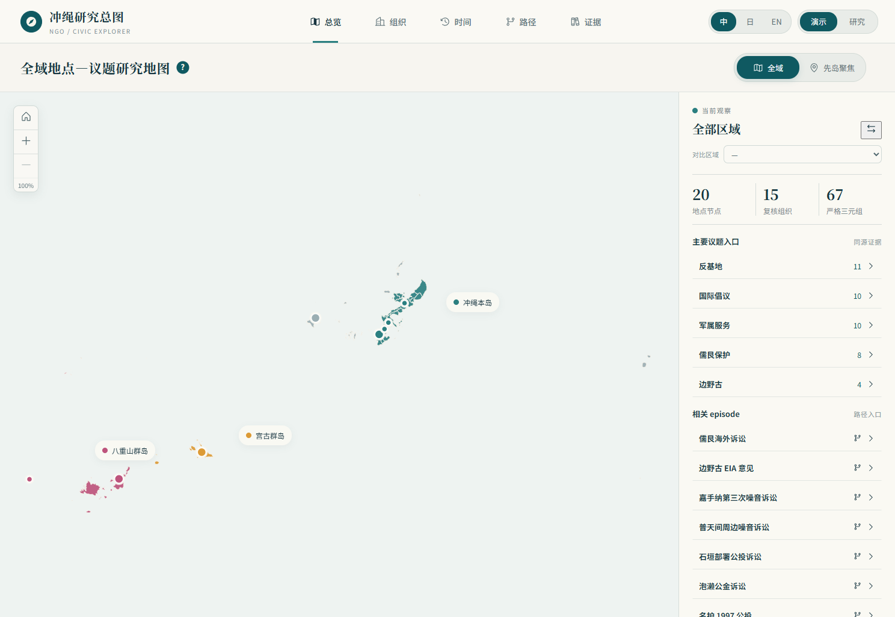

### 总览（研究视图）

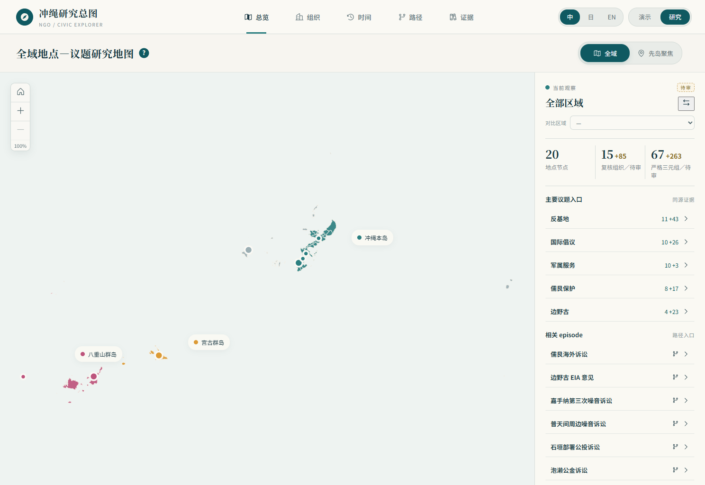

### 总览（地区对比）

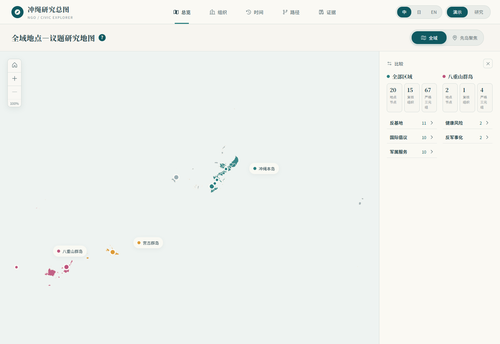

### 组织（演示视图）

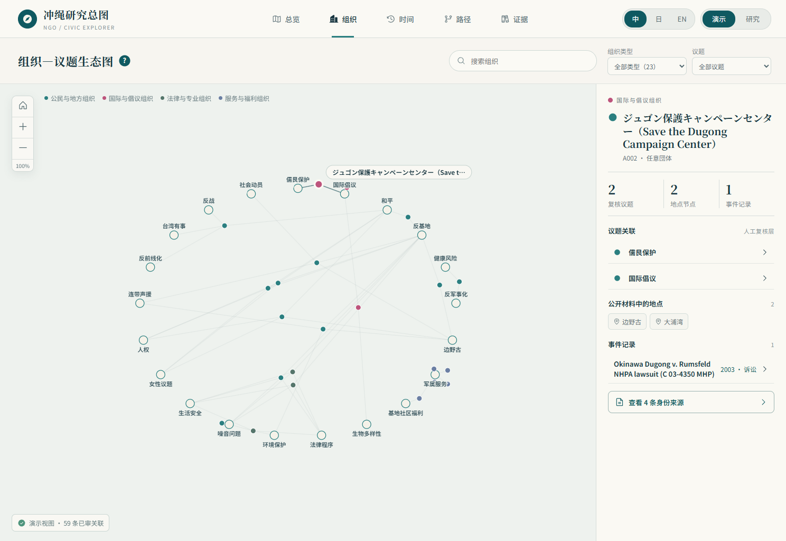

### 组织（研究视图）

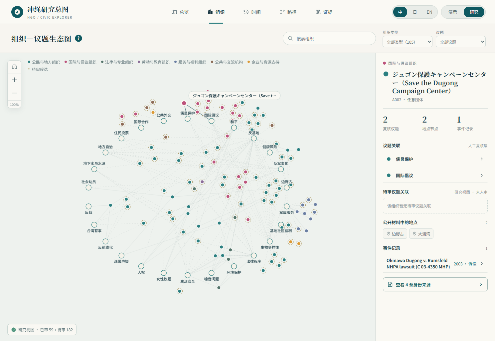

### 时间

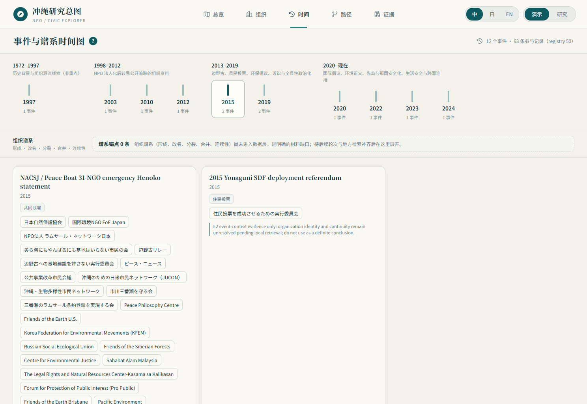

### 路径（演示视图）

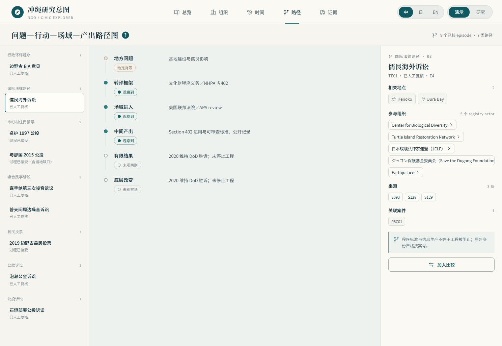

### 路径（研究视图）

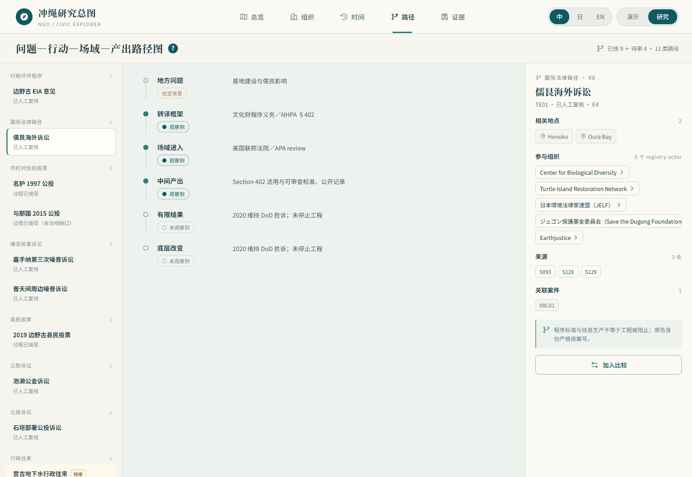

### 路径（episode 对比）

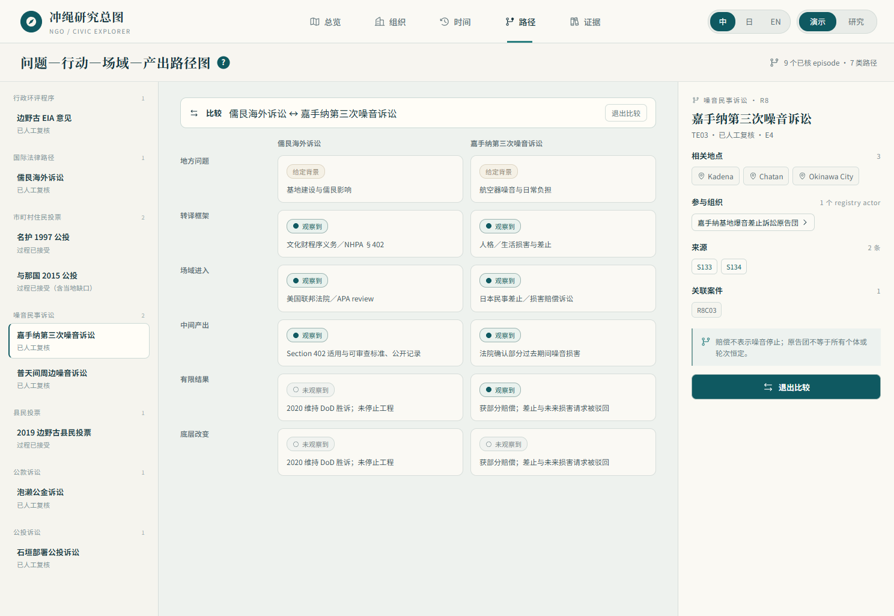

### 证据（演示视图）

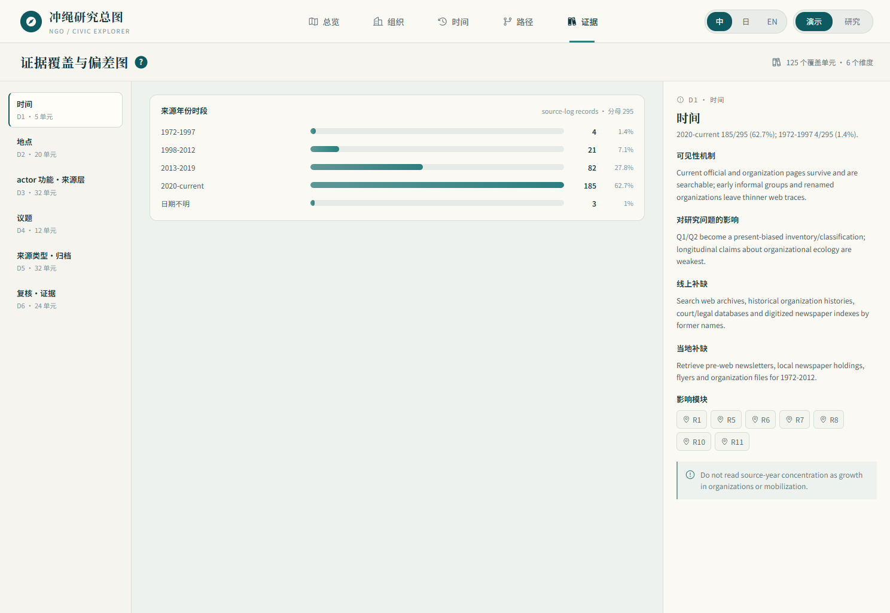

### 证据（英文界面）

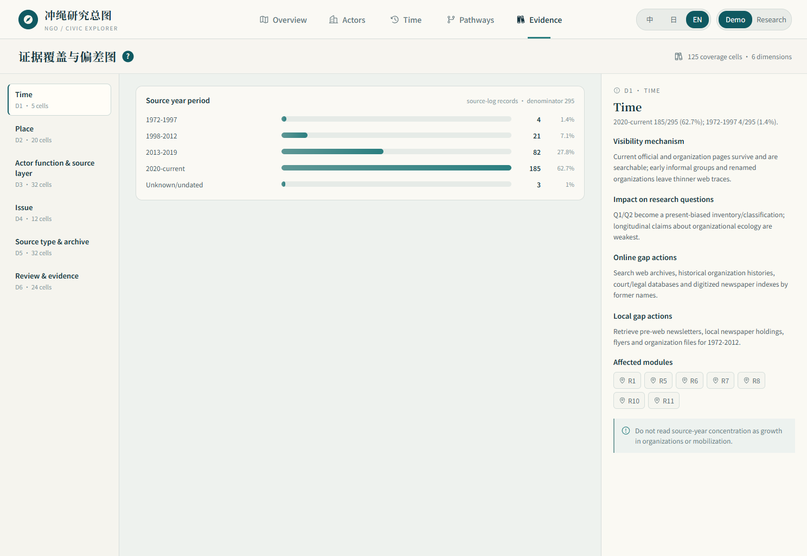

### 证据抽屉（含 locator）

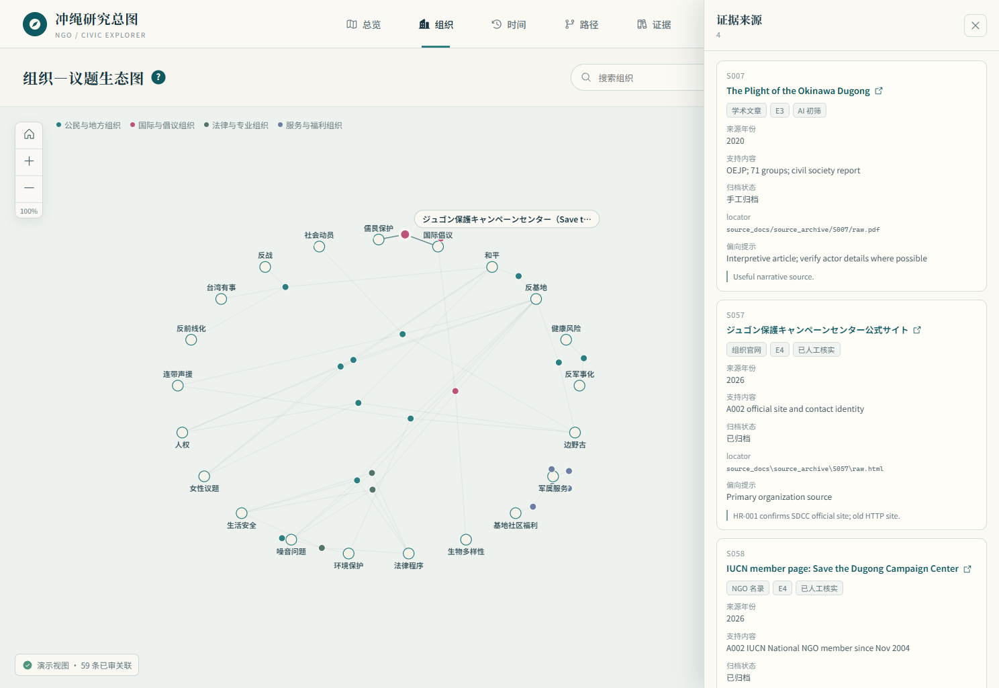

## 未决人工判断

- 三语映射敏感措辞按负责人审定稿落地；映射表建议随 NR-02 下次重建纳入构建输入以获得哈希保护。
- 组织谱系仍为 0 锚点；NR-04／NR-05 结果未经负责人决定不得进入该层。
- 事件名、部分来源 supports／bias_note／interpretation_limit 为数据层英文字段，按原样显示；是否翻译属数据层决定。
- 画布节点本身不可键盘聚焦（canvas 技术限制）；键盘与读屏路径由搜索下拉、区域按钮和各页 DOM 面板提供。
- 部署未授权。

## 不得被主线程误读为

- 已核层≠全量数据：普通界面有 121 个可见 actor，但已核议题网络只使用 65 条已核边；
  它是“可公开辩护”的关系子集，不能用 actor provenance 行数替代关系 gate。
- 研究视图的虚线与待审项是候选，不是事实；共同联署与同场参与不是稳定联盟。
- 时间页时段节点是一期方案的采集策略，不是数据断言；事件年份不代表组织成立或持续。
- 地图只有市町村几何，没有基地／组织点位；区域颜色不表示组织密度或活动强度。
- 证据页计数是工作样本的文献可见度，不是冲绳民间组织总体分布。
- 前端不读中央 CSV，不改中央表；`PLACE_DISPLAY_REGION` 与七组分类映射为展示层，不反写。

## 建议下一 session

- 主线程复验通过后派 NR-04／NR-05（两个历史时段线上补缺）。
- 把 `display_label_mapping_draft_v0.csv` 纳入 NR-02 构建输入并重跑。
- 5 分钟演示路径文档可在 NR-06 验收前补齐。
