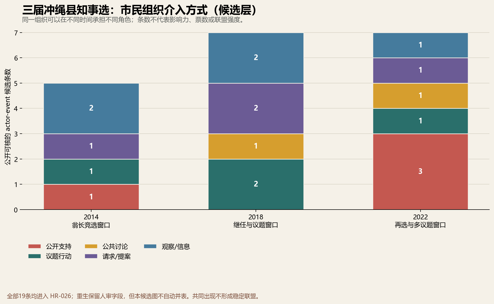
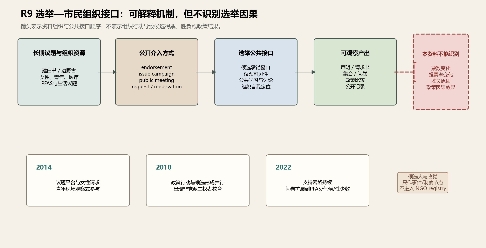

# R9 选举—市民组织接口 brief v1

日期：2026-07-13

状态：**候选事实层；HR-026 人工字段按稳定 review item ID 保留。当前已填写 0 条、待处理 19 条。**

## 1. 交付与证据边界

本包为2014、2018、2022三次冲绳县知事选建立 **19 条 actor–event 候选观察**：2014年 5 条、2018年 7 条、2022年 7 条。动作类型严格拆为：`endorsement` 4、`issue_campaign` 4、`public_meeting` 2、`request` 4、`observation` 5。

`source_proposals_v1.csv` 保留本模块生成时的历史 proposal 状态；当前 provisional source ID 以 `outputs/next_wave_source_integration_v1/proposal_to_source_crosswalk_v1.csv` 为权威。来源已进入中央 source log 只建立索引，所有行仍为 `relation_or_claim_approved=no`，没有批准 actor registry 或正式关系。个人候选人、政党、临时选举协调体只作事件／制度节点。

三届都达到 `minimum_public_window_found`，不存在“整届完全无资料”的阻断。不过，2014两个女性活动的完整组织名单、2018 `#みんなごと` 公开讨论会的具名候选节点、2022问卷原表与8/13女性集会主办名已在线耗尽，详见 `online_gap_register_v1.csv`。



## 2. 三届的解释性比较

### 2014：议题平台、出马请求与青年观察式参与并存

7月的「沖縄『建白書』を実現し未来を拓く島ぐるみ会議」把建白书与长期反基地议题重新组织成公开平台。日本YWCA当时的记录明确说该组织**并非直接为知事选而设**，因此本包只编为 `issue_campaign`，不编为 endorsement。

8月的女性请求团体向翁长雄志提出出马请求，10月的女性集会则是明确候选支持，两者分别编码为 `request` 与 `endorsement`。`ゆんたくるー` 的现场学习巴士把选举窗口转化为青年观察、同辈对话与基地现场学习，编为 `observation`。这说明“参与选举公共空间”不只有支持候选一种形式。

### 2018：政策行动、继任人选形成与非党派学习通道交叠

翁长知事生前的撤回表明及逝世后的8.11大会，是边野古政策行动／追悼动员，不自动等同于候选支持。随后，由县政与党会派、政党、劳组和企业构成的临时「調整会議」向玉城Denny提出出马请求；该协调体只作为选举事件节点，不能写成稳定NGO联盟。

同期 `#みんなごと` 组织候选公开讨论、公众政策提案工作坊和报纸政策比较，展示了另一种接口：组织不必支持某一候选，也可以把选举变成主权者教育、问题比较和公共讨论的窗口。其2018活动由参与者撰写的学术记录完整列日，但候选人姓名在表中被隐去，本包不依据时间线猜名。

### 2022：支持网络持续，同时议题入口明显扩展

女性有志团体、全日本民医连和新日本妇人会分别形成出马请求或公开支持窗口。7月30日 All Okinawa线上大会按组织原始页面编为基地负担 `issue_campaign`；由于地方媒体记录了“県民大会还是决起集会”的政治争议，其措辞单独送 HR-026。

同年，县民有志问卷把候选观察扩展到气候、能源、PFAS、性少数等26主题74问，并以两场公开谈话展开讨论。这个变化支持“选举公共接口的议题范围扩张”这一描述，但不能推断议题改变了投票选择。

## 3. 非因果机制



可安全讨论的机制是：长期议题与组织资源，通过公开支持、议题行动、公共讨论、请求或观察，进入选举公共接口，并留下声明、请求、集会、问卷与政策比较等**可观察记录**。这叫“议题—制度接口”，不是“组织行动导致选举胜负”。

本包不能回答：

- 某组织带来多少票、提高多少投票率；
- 哪次集会造成候选胜负；
- 同场出现是否构成稳定联盟；
- 候选接受问卷、提案或集会诉求后是否改变政策；
- 政党、候选人或临时选举体是否应进入NGO registry。

## 4. HR-026 复核重点

`HR026_election_civic_role_review_v0.csv` 有 19 项；重生时保留既有 decision／reviewer／date／note 及附加 final/status 字段，不把已填写值清空。优先复核：

1. 2014岛ぐるみ会议与A059的实体映射，以及“非直接选举目的”边界；
2. 女性请求团／女性集会的组织名、名单数量与 request/endorsement 区分；
3. 2018 All Okinawa 两次议题集会不得改写为候选支持；
4. `#みんなごと` 的公开讨论、提案草拟、发布三种角色不可合并；
5. 2022 All Okinawa大会的争议性措辞；
6. 问卷中具志坚隆松、元山仁士郎等个人参与不得转嫁为其关联组织角色；
7. 所有组织自述的“支援／奋战”不得升级为票数或胜负因果。

## 5. 复现

运行：

```powershell
python scripts\make_r09_election_civic_interface_v1.py
```

脚本从内置、可审计的候选记录生成两张图、事件表、三届窗口表、source proposal、HR-026、在线缺口与验证报告；重复运行字节稳定（图的metadata日期固定）。
