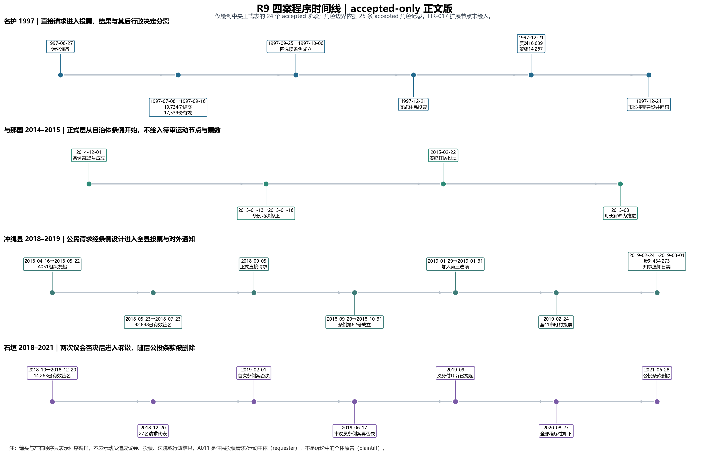
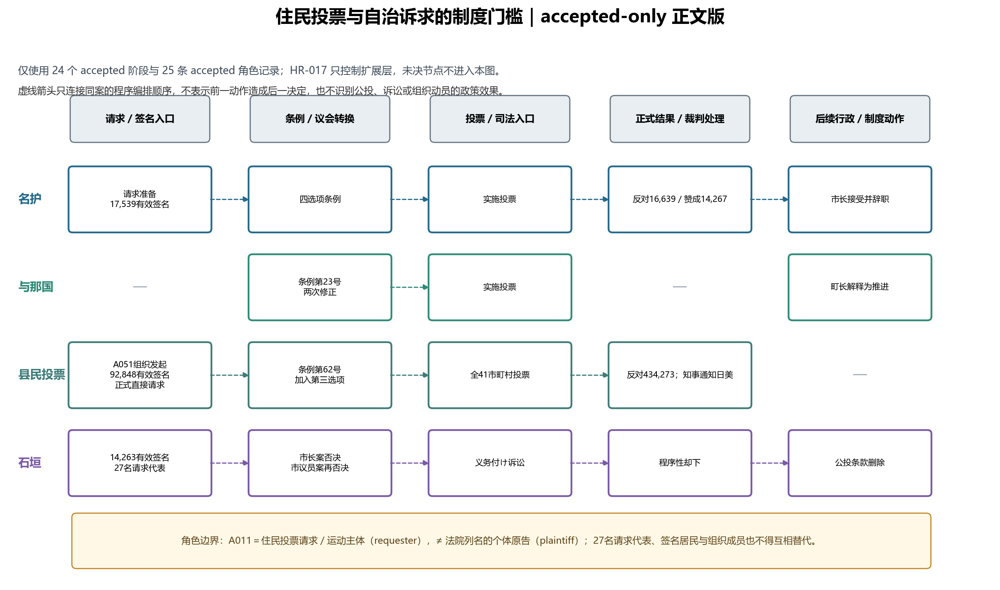

# R9 住民投票／意见广告／诉讼程序 brief v1

日期：2026-07-13

状态：正式程序层；含明确待人审／当地检索边界。

## 1. 本轮正式化结果

中央正式阶段表只含 **24 条 accepted**，模块正式角色表只含 **25 条 accepted**。模块内审计全量表另保留33个阶段与34条角色，其中9个阶段、9条角色进入HR-017；因此合并计数为 **49条正式阶段/角色、18条待人审、6条拒绝说法**。来源登记共 32 条，其中 20 条正式接受、10 条限界使用、2 条拒绝。

正式层不把“住民投票”压成单一事件，而把它拆为：

`公众动员 → 代表/签名资格 → 条例议程与设计 → 议会/行政执行 → 投票或司法可诉性 → 结果再解释`

这条链说明，民间组织提出的自治诉求必须经过多个制度门槛。门槛既可能放行，也可能改变问题设计、阻断投票、把行动推向法院，或把结果转化为行政与对外倡议资源。

两张正文图只读取中央正式表的 **24 个 accepted 阶段**与模块正式表的 **25 条 accepted 角色记录**，不含 HR-017 待审节点。HR-017 只控制扩展层，不再阻断正文图。旧版 `referendum_process_timeline_v0.png` 与 `institutional_gate_flow_v0.png` 继续作为 reviewed-all 历史审计附录保留，不用于正文确定性结论。

图中的箭头与左右顺序仅表示程序编排，不识别动员对议会、投票、法院、行政或政策结果的因果效果。角色上，**A011 是住民投票请求／运动主体（requester），不是法院列名的个体原告（plaintiff）**；请求代表、签名居民、组织成员和个人原告不得互相替代。

## 2. 四案比较结论

### 名护 1997：投票实现，不等于行政受法律拘束

直接请求经17,539份有效签名、议会四选项修正和条例成立进入投票。名护市官方 XLS 确认：赞成2,562、条件付赞成11,705、反对16,254、条件付反对385；合并赞成14,267、合并反对16,639；投票者31,477、有效票30,906、无效565、投票率82.45%。三日后市长宣布接受海上基地并辞职。

机制：公民诉求通过签名与条例门槛，但咨询型结果没有自动约束后续行政决定。 若写比例，必须注明16,639占全体投票者约52.85%，占有效票约53.84%。

### 与那国 2012–2015：公众动员与自治体条例是并行层

A015 的2012意见广告和 A014 的2015反对运动只在reviewed-all／HR-017层保留为 E2 线索，未进入正式阶段或角色表。它们需要八重山报纸、广告实物、町议会/选管材料或组织档案；当前不能作为确定性组织结论，更不能证明发起或实施住民投票、或证明两个委员会组织连续。正式条例文本只支持执行主体为町长／选管。

地方报道所载赞成632、反对445、无效17、选举人1,276、投票率85.74%同样属于HR-017待审阶段；取得町选管原表前不得进入正式阶段表，只能表述为“地方报道所载数字”。町长施政方针可正式证明行政如何解释结果，但不代表全体町民共识。与那国的主框架是前线化、地方自治、台湾邻近与生活／健康风险，不强行环境化。

### 冲绳县民投票 2019：公民请求转为县级条例和外部通知

官方委员会记录闭合 A051、元山仁士郎、安里長従、中村昌樹与条例制定请求代表角色。92,848份有效签名超过法定23,171；经县议会立法和加入第三选项后，全41市町村实施投票。反对434,273（71.7%），知事依据条例向日美政府通知。

机制：公民动员被转换为县条例、行政执行和对外通知资源。 33名请求代表、92,848名签名者与A051成员必须分开。

### 石垣 2018–2024：议会阻断后，司法门槛再分流

14,263份有效签名和27名请求代表进入直接请求。第一次条例案由市长提交并于2019-02-01被否决；**第二次是2019-06-17市议员提出的議案第2号**，也被否决。不得写成运动方直接提交或市长第二次付议。

两条诉讼链必须分开：

1. 实施义务付け等：令和元年（行ウ）第14号・第15号，2020-08-27那霸地裁全部“却下”；这是已进入正式表的程序性／适法性处理，不是部署政策实体判断。令和2年（行コ）第3号的高裁终结阶段仍在HR-017。
2. 地位确认等：令和3年（行ウ）第5号 → 令和5年（行コ）第6号 → 2024-09-26最高裁决定后败诉确定，整条链的裁判阶段目前保留在reviewed-all／HR-017，不在正式阶段表。最高裁官方决定书与案号未取得，现阶段不得确定写成“棄却”或“不受理”。

2021-06-28市议会删除自治基本条例第27/28条，只能解释为制度机会结构改变，不推断由诉讼直接造成。

## 3. 角色边界

- `requester`：正式请求代表；不自动等于组织全体成员。
- `individual_plaintiff`：诉讼个人原告；不得转嫁为 A011 或其他支持组织的原告身份。
- `supporter`：公开倡议或诉讼支持；不同于原告与律师。
- `counsel`：诉讼代理功能；不因判决列名自动建立个人／律师团 actor。
- `government/council/election administration/court`：制度 counterpart 或场域，不是运动 actor。
- A068：官方事件名为“名護市民投票推進協議会”，与 registry 现名的改名／alias／拆分继续待人工决定。
- A014/A015：均维持 E2 和当地检索；不自行解决组织身份。
- A011：可写公开组织者／支持者，不能写法院确认的组织原告。

## 4. 待人审与当地检索

1. A068 规范名与官方事件名的映射。
2. A014/A015 的成立、代表、成员、持续性及意见广告实物。
3. 与那国町选管正式结果表、町公报和议会修正记录。
4. 石垣第一条高裁判决全文；第二条那霸地裁官方判决；最高裁案号与决定书。
5. A011 历史官网／会报、27名请求代表与个人原告的组织映射。

## 5. 解释边界

R9 支持的解释是“自治诉求如何被程序门槛转换”，不是“公投必然导致政策变化”的因果识别。共同动员、意见广告、请求、投票与诉讼支持都不能自动写成稳定联盟；法院程序结果也不能转写为组织政治立场。

正式表、审计全量表与图由 `scripts/make_r09_referendum_process.py` 同源生成：accepted-only 正文图只读取正式表；旧 reviewed-all 图单独保留为历史审计附录。外键、来源、票数、关键措辞、图文计数和重复运行稳定性均已检查。
