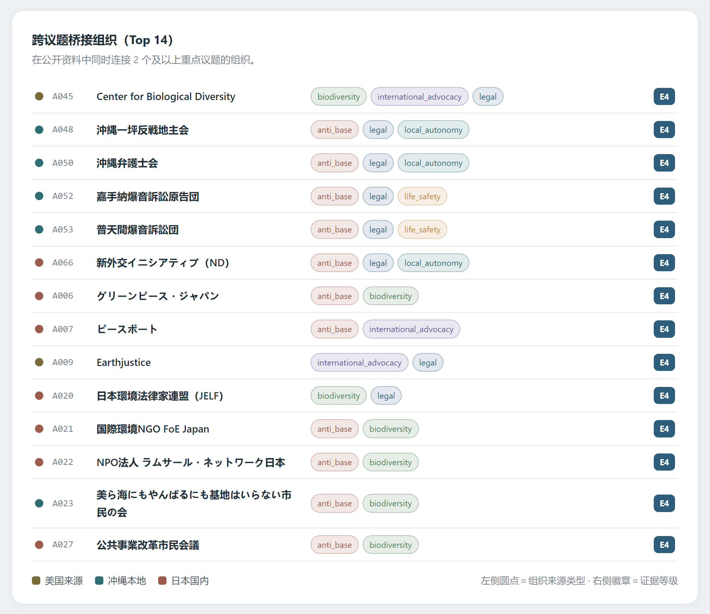
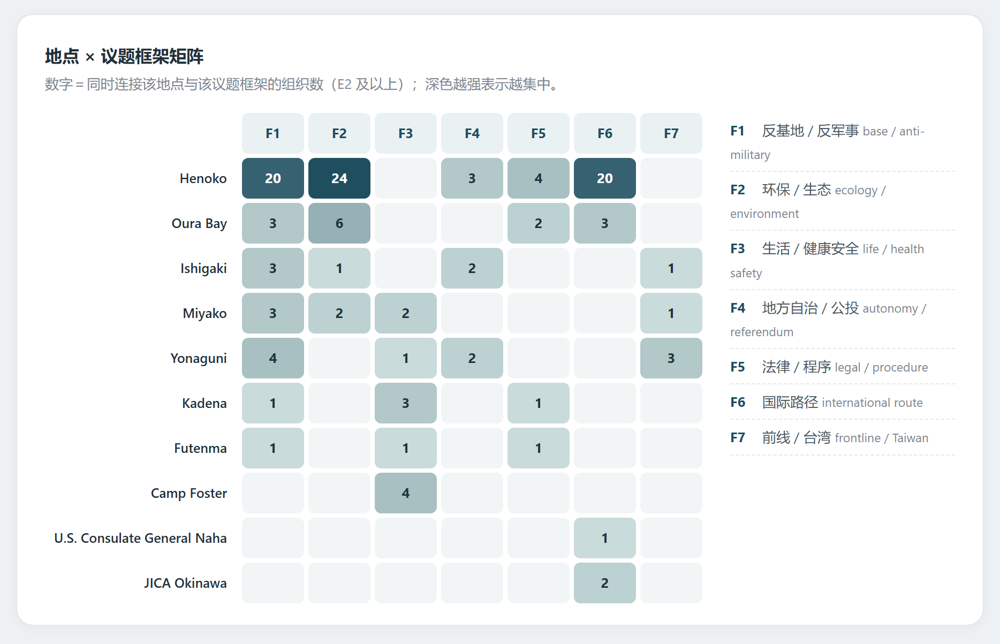
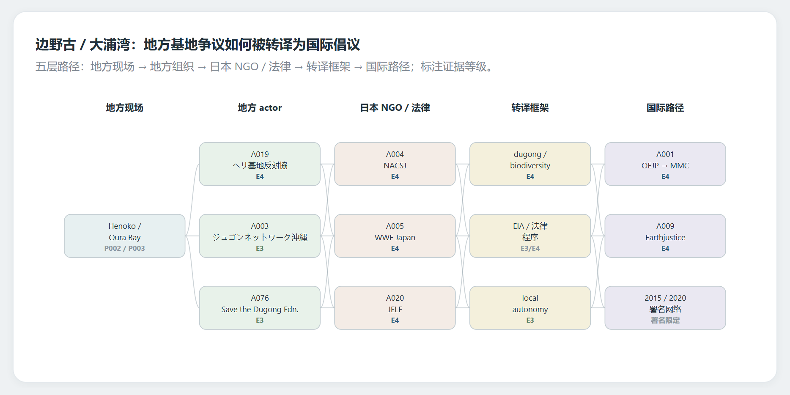
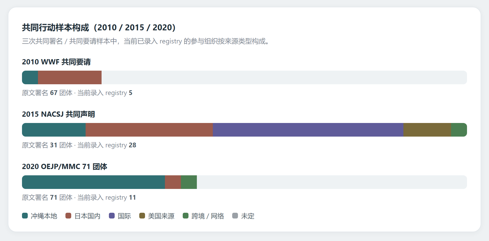

# 复归后冲绳民间组织 / NGO 分类与议题网络 ——第二次进度同步

这一轮主要把数据底座推进到可解释的图表和研究模块产出，并明确了后续调查方向。

## 本轮主要进展

在第一次同步（方案调整 + 数据底座）的基础上，这一轮做了三件事：把样本和关系表扩到可以出图的规模、完成第一轮人工复核、并把方案里的几个选作研究模块推进到可解释的初版。

当前样本：93 条 actor、92 条 source（其中 76 条真实 URL 已完成本地备份，防止链接失效）、180 条 actor-issue 候选关系、124 条 actor-place 候选关系、27 条 support/funding sample。议题 19 类、地点 20 个。这些关系仍是候选关系，用于搭建结构和确认方向，不直接作为最终结论。

另外，2020 年 OEJP / MMC 的 71 团体共同要请名单已经完整抽取，析出 52 个可考虑纳入 registry 的候选组织。

## 研究模块菜单：正在推进哪些，为什么

按方案 5.2 的排序标准（是否直接服务核心问题、数据是否相对易得、AI / 代码能否有效辅助、产出是否适合汇报和可视化），这一轮优先推进了下面几个模块，都已有可解释的初版产出：

| 模块 | 当前状态 | 为什么先推 |
| --- | --- | --- |
| 基础建设（必做） | 数据底座 + 覆盖偏差审计 + 编码规则已有 v0 | 是全项目的数据地基，其他模块都依赖它 |
| R2 组织—议题网络 | 桥接组织图 + 桥接清单 | 直接回答"组织如何把基地问题接到环保 / 自治 / 法律 / 国际倡议" |
| R3 地点与空间分布（含与那国 / 先岛专题） | 地点 × 议题框架矩阵 | 数据相对易得，能直接出图，覆盖核心地点 |
| R4 环保 / 生活安全框架与军事设施争议 | 并入地点 × 议题矩阵的框架维度 | 与 R3 共用同一批关系，边际成本低 |
| R5 联盟 / 共同行动网络 | 2010 / 2015 / 2020 三个共同行动样本 | 有公开署名 / 要请材料，但只做到"共同行动样本"层，暂不写成"联盟" |
| R6 / R11 跨国 / 国际倡议网络 | 边野古 / 大浦湾国际化路径图 | 边野古国际化材料公开、清晰，是方案的重点方向 |

暂时后置或只作背景的：R1 全量分类与组织生态（要等 registry 更完整）、R7 场域转移、R8 法律 / 政策 / 环境程序（目前作背景）、R9 选举 / 县民投票连接、R10 公开资源 / 行政协作（依赖当地和机构材料）。方案 5.3 的扩展模块 R12 / R13 / R14 明确不进入标准一期。

## 是否符合工期

符合。对照方案 6.1.3 的七周规划：第 1 周（收束问题、边界、样本口径、编码规则）、第 2–4 周（组织样本、议题 / 地点 / 场域整理、组织—议题 / 组织—地点 / 共同行动关系抽取）都已完成；现在处在第 5–6 周的位置——方案 6.1.2 要求的五个核心可视化（组织—议题网络、地点—议题图、国际倡议 / 法律程序路径图、与那国 / 先岛专题图、覆盖偏差图）都已经有初版。

接下来是第 5 周的深化（与那国 / 先岛专题还需要地方材料补强）和第 6–7 周的研究报告、论文起草与最终数据包，进度上没有落后。

## 核心图表

**组织—议题网络（R2）**：显示在公开资料中同时连接两个及以上重点议题的组织，即把基地问题接到环保、自治、法律、国际倡议的桥接点。只说明"公开资料中的议题连接"，不代表组织长期主打议题。

**地点 × 议题框架矩阵（R3 / R4）**：边野古 / 大浦湾集中在环保 + 反基地 + 国际路径；石垣 / 宫古偏生活安全、地下水、住民投票；与那国按前线 / 台湾、地方自治、住民投票读取，不强行环保化。

**边野古 / 大浦湾国际化路径（R6 / R11）**：地方基地争议如何被转译为儒艮 / 生物多样性、环境影响评价、法律程序和国际倡议。这是路径图，不是资金链，也不是稳定联盟图。

**共同行动样本构成（R5）**：2010 / 2015 / 2020 三次共同署名 / 共同要请里，当前已录入 registry 的组织按来源类型构成。色条统计的是当前录入的组织，不是原文全量署名数；2020 年 71 团体已抽全，多数还没审入 registry，这正是下一步。

## 人工复核与口径

方法上继续沿用证据分级（E1–E4）。已完成第一轮人工复核（HR-001 至 HR-009），并对真实 URL 来源做了本地归档。只有证据较充分的关系才进入正式分析。

保持保守口径：候选关系不当结论、共同署名只写"共同行动 / 共同发声"不写稳定联盟、grant opportunity 不写成已拨款、军属服务 / 慈善组织按观察到的功能编码、与那国按前线安全 / 地方自治 / 生命安全读取。

## 下一步

线上能做的材料我们直接推进，不再单列为待派任务，包括军属配偶慈善组织的公开 recipient、USO 赞助网络、公开年报和失效网站的 Web Archive 回捞等。只有少数真正需要当地协作者或馆内数据库的部分留待正式派单：与那国 / 先岛的地方报道与议会资料、报刊数据库时间线。

同时，从 2020 MMC 71 团体候选中逐条决定是否录入 registry，并继续把 actor registry 扩到 120 条以上。
