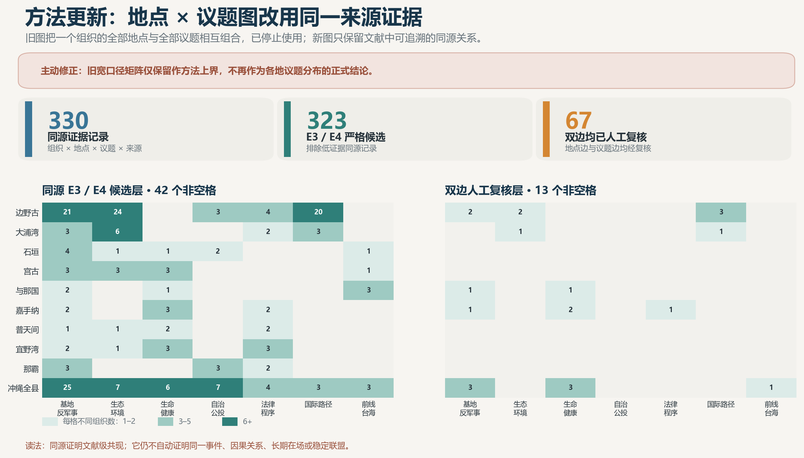
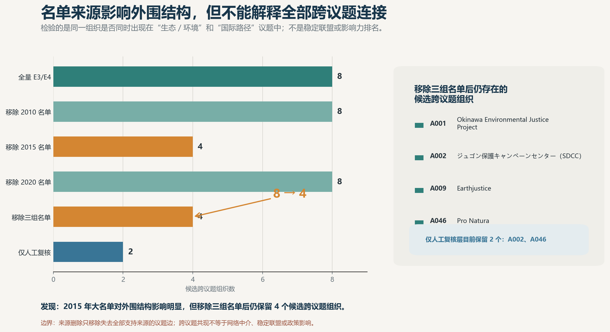
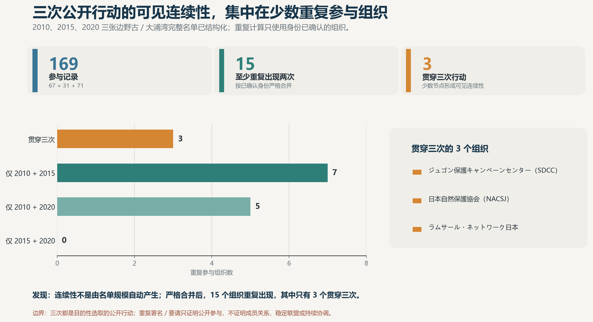
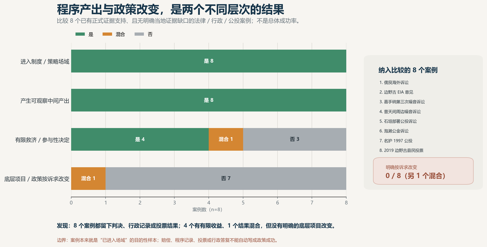

# 复归后冲绳民间组织 / NGO 分类与议题网络

## ——第三次进度同步

第二次同步后，样本已达到 122 个组织级 actor、295 条来源记录。这一轮的重点不是继续堆数量，而是把已经能够出图的关系收紧为可核、可比较的证据层。

## 主要进展

- 组织样本达到一期方案 120–180 的数量下限，但仍是公开资料驱动的研究样本，不代表复归后冲绳民间组织总体。
- R1–R11 已形成不同深度的线上材料层；其中法律／政策程序的 6 个案件、27 个角色已经全部人工核实。
- 2010、2015、2020 三张共同行动名单已完整结构化为 169 条参与记录，并能区分一次出现与重复参与。
- 新补入的材料修复了宫古地下水、宜野湾 PFAS、港湾劳动和女性动员四个原来较薄的观察层；没有因此推定新的组织联盟关系。

目前已经从“扩表和模块底稿”进入方法修正、关键证据人工冻结和最终研究成品生产阶段。

<!-- 建议分页 -->

## 方法更新：两项旧图口径已经主动修正

第二次同步中的地点 × 议题图，是把同一组织出现过的地点和议题作宽口径组合，不能证明某一地点确实出现某一议题，现已停止作为正式结论。本轮改为只保留同一来源能够同时支持的“组织—地点—议题”记录。

完整组织—议题网络也改为两层并列：E3／E4 候选层用于探索，人工复核层用于正式解释。边野古／大浦湾仍是目前证据最完整的跨尺度转译案例，但不再写成唯一、完整或已经成功的国际化路径。

第二次同步中“进度没有落后”的判断也不再沿用：线上基础设施和模块底稿已经形成，但关键证据冻结及报告、论文、PPT、公开数据等合同成品仍未完成。

**发现：**现有 330 条同源证据记录中，323 条达到 E3／E4，67 条的地点边和议题边均已人工复核。候选层仍呈现较多地点—议题组合，但人审层明显收缩，下一步重点是冻结关键关系，而不是继续扩大旧图。

<!-- 建议分页 -->

## 组织—议题连接是否依赖少数大名单

**发现：**移除 2015 年大名单来源后，“生态／环境—国际路径”候选组织由 8 个缩到 4 个；同时移除三组名单后仍保留 4 个，说明外围结构受名单影响，但并非全部依赖这些名单来源。当前人工复核层只保留 2 个，因此这些结果仍不能写成稳定桥梁、联盟或影响力排名。

<!-- 建议分页 -->

## 三次公开行动中，哪些组织重复出现

**发现：**三张完整名单共有 169 条参与记录；按已确认身份严格合并后，只有 15 个组织至少重复出现两次，其中 3 个贯穿三次。这三次行动中的可见连续性集中于少数组织，但共同署名／要请不等于成员关系、稳定联盟或持续协调。

<!-- 建议分页 -->

## 进入制度场域以后，通常产生什么

**发现：**在 8 个已有正式证据支持、且无明确当地证据缺口的案例中，8 个都留下判决、行政记录或投票结果；4 个有有限救济或参与性决定、1 个结果混合，但没有一个能够写成底层工程或政策按诉求明确改变。

这组案例本来就是已经进入法律、行政或公投场域的目的性样本，不是总体成功率。在这组已进入场域的案例中，较常见的结果是程序记录和公共证据，而不是底层项目改变；“进入程序”“获得有限结果”和“改变底层项目”是三个不同层次。

<!-- 建议分页 -->

## 人工复核与下一步

目前最稳固的是法律／政策程序层和正式事件层；组织—议题边现有 59／241 条完成人工复核，组织—地点边为 17／135 条，完整网络和空间图仍不能称为最终冻结版。

下一步继续做三件事：优先冻结会改变主要结论的组织—议题／地点关系；把同源记录继续收紧到可定位的来源 × 事件 × 日期；只把线上已经耗尽、且会改变图表解释的与那国／先岛地方材料和完整 recipient 年表交给当地协作者。完成这些以后，再进入正式报告、论文、PPT 和公开数据包的装配。
