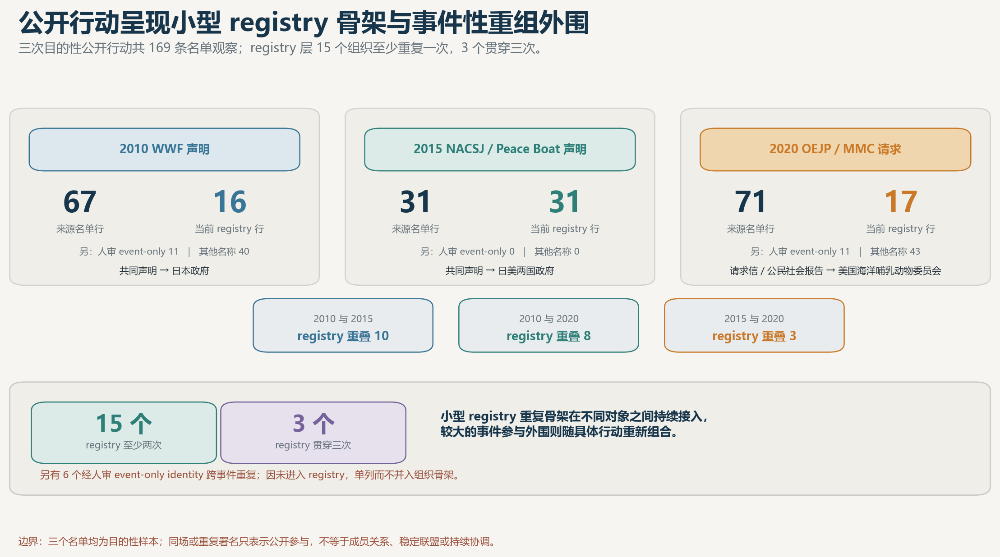

# 复归后冲绳民间组织 / NGO 分类与议题网络

## ——第三次进度同步（解释性发现版）

第二次同步以后，项目已经不只是继续扩组织和关系表，而是开始回答一个更具体的问题：**地方争议如何被民间组织转换成法律、环境评价、公投、行政或国际机构能够受理的主张；进入这些制度以后，又实际留下了什么。**

当前 registry 保留 122 条可追溯记录，其中 1 条是重复组织 tombstone，实际有效组织为 121 个；来源记录 295 条。R1–R11 已形成不同深度的线上证据层，其中法律／政策程序 6 案、27 个案件角色已经全部人工核实。

## 发现一：组织的重要作用不是“连接更多节点”，而是翻译地方损害

**发现：**不同地点并不是简单换一套反基地口号。海洋新建工程被转译为儒艮、文化财、科学评价和县民意思；既有基地的慢性噪音被转译为人格、期间损害和赔偿请求；先岛的新部署与前线化，则进入自治、公投、地下水、撤离和生活恢复等问题。

这意味着组织的解释性作用更接近“翻译器”：把地方经验改写成某个制度能够受理的科学、损害、自治或程序主张。不同翻译方式也会塑造后续能够进入的场域和可能获得的结果。

<!-- 建议分页 -->

## 发现二：在现有正式案例中，制度吸收部分诉求，但没有提供项目否决

**发现：**生态／国际程序留下审查标准、正式意见和公开记录；噪音诉讼确认部分损害并产生赔偿；公投和直接请求能够形成条例、投票、通知或司法判断；泡濑公金诉讼甚至在第一波限制了未来支出。

但这些制度收益都有清晰边界：程序记录没有自动停止工程，噪音赔偿没有形成运营禁令，公投结果也没有自动拘束后续行政决定。在这组已经进入制度场域的案例中，最有价值的解释不是“行动成功或失败”，而是：**制度通过承认、记录或补偿一部分诉求，把运行停止、工程否决和行政拘束留在门外。**

<!-- 建议分页 -->

## 发现三：公投不是一个结果点，而是一条制度门槛链

**发现：**名护、与那国、2019 县民投票和石垣四案走出了不同路径。签名可能进入投票，也可能在议会被两次阻断；条例可以重新设计选项；投票结果又会被市长、町长或知事转化成不同的行政和对外行动。

因此，公投不能写成简单的“民意输入—政策输出”。它更像一串门槛：制度可以放行、改写问题、阻止投票，或在投票完成后重新解释结果。石垣达到签名门槛却没有投票，正是这套机制最清楚的负案例。

<!-- 建议分页 -->

## 发现四：先岛三地可能形成了三种不同的地方问题化方式

**当前解释假设：**宫古的地下水依赖，使部署争议进入水源和生活条件；石垣以签名、公投和诉讼把部署组织成“谁有权决定”的自治问题；与那国的台湾邻近位置，则使争议集中到前线监视、岛外撤离和生活恢复。

这个差异很有研究价值，但目前宫古和与那国的线上材料明显受政府、议会和防卫机构来源支配。当地核查的目的不是再补几篇新闻，而是检验“地下水—自治—前线化”的差异究竟来自民间组织自己的表达，还是来自线上材料保存偏差。

<!-- 建议分页 -->

## 发现五：冲绳民间组织生态不能被压缩成一张反基地网络

**发现：**在冲绳县 FY2024 的 616 条 NPO 等协作来源行中，委托、提案型委托、指定管理和补助／物的支援占 76.1%；来源行最多的五个部门集中在医疗、教育、福祉、儿童和文化旅游，占 71.9%。人权／和平与国际协作合计只占 3.1%。

这提供了一个重要基线：一期重点观察到的基地、和平、国际倡议和环境组织，只是官方协作所显示的更大公共服务生态中的特定部分。报告中应把抗争／倡议网络、行政协作、服务／慈善和公共外交分开呈现，而不是全部混成同一种 NGO 网络。

<!-- 建议分页 -->

## 发现六：公开行动呈现“小骨架、变动外围”，不是固定联盟整齐出场

**发现：**三次边野古／儒艮公开行动共有 169 条名单观察；按当前 registry 身份层合并，15 个组织至少出现两次，只有 3 个贯穿三次。另有 6 个经人审核定的 event-only identity 跨事件重复，但因尚未进入 registry，不计入这 15 个组织骨架。不同年份的行动对象也从日本政府、日美两国政府转向美国专门机构。

因此，这组样本更像少数组织持续承担议题和场域桥接，较大的参与外围则围绕具体行动重新组合。它解释了为什么“共同署名”有分析价值，却不能直接写成稳定联盟。这个结论仅适用于三次目的性样本；未经人审合并的 event-only name 不作跨期强行合并，人审 event-only identity 也不当作 registry 组织。

## 方法修正与当前边界

第二次同步中的地点 × 议题宽口径矩阵已经停用，完整组织—议题图也已拆成候选探索层和人工复核层。边野古／大浦湾只写成当前证据最完整的跨尺度案例，不写成唯一或成功的国际化路径；“进度没有落后”的旧判断也不再沿用。

另外，来源删除检验中，“生态／环境—国际路径”候选组织从 8 个缩到 4 个，说明桥接组织的范围仍受关键名单来源影响。该结果适合放在附录说明来源敏感性，不作为正文中的稳定网络结论。

## 下一步与当地核查

下一步线上工作围绕上述机制继续收紧案例，不再无目标扩搜。当地协作者优先补三类会直接改变结论的材料：

1. 宫古、石垣、与那国民间组织自己的陈情、会报、传单、意见广告、请求书和会议记录，用同一字段比较三地如何表述损害、目标对象和制度诉求；
2. 与那国 2015 公投正式结果表、条例修正和町议会记录，以及 A014／A015／A016 的身份和持续性；
3. 若最终报告继续使用“复归后”长期标题，再补 1972–2012 年地方报刊、组织通讯、成立／改名／解散和关键行动时间线。

当地任务的验收标准已经写入正式任务书。取得材料以后，最优先检验的不是“有没有更多组织”，而是上述三种先岛框架和制度转译机制是否仍然成立。
