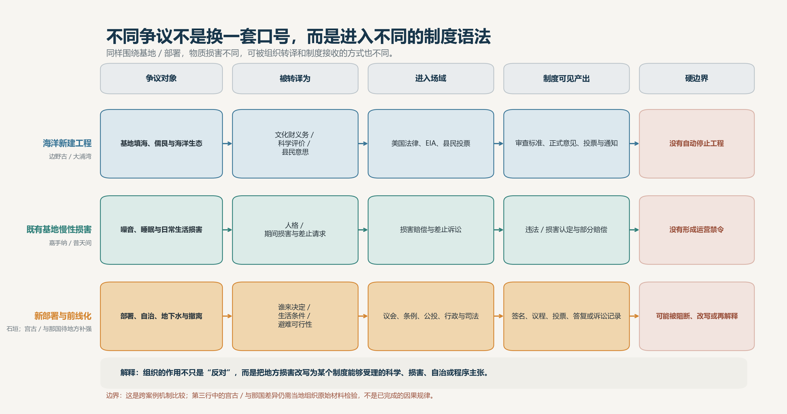
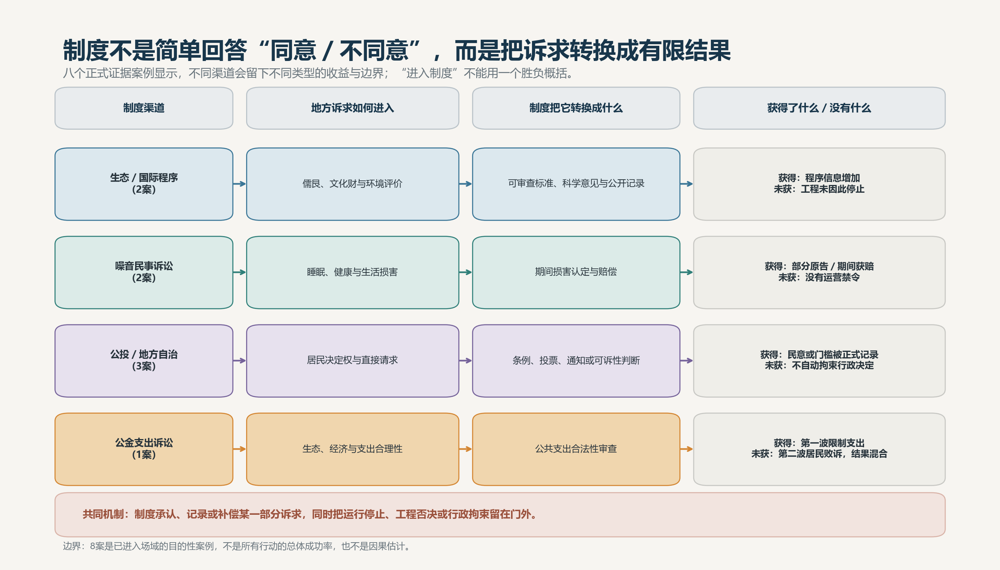
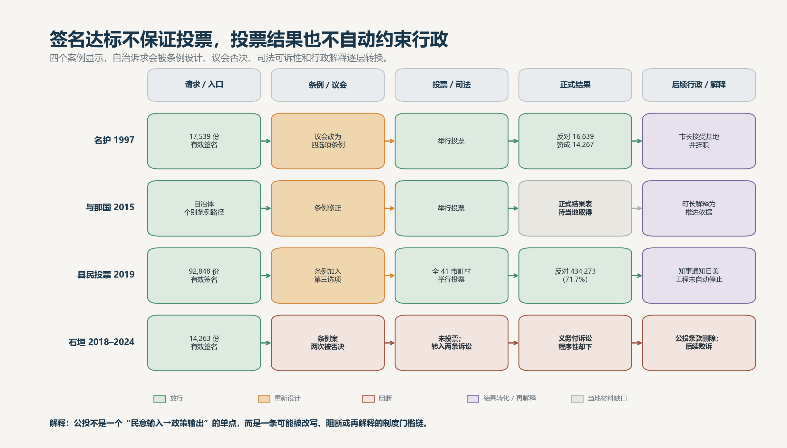
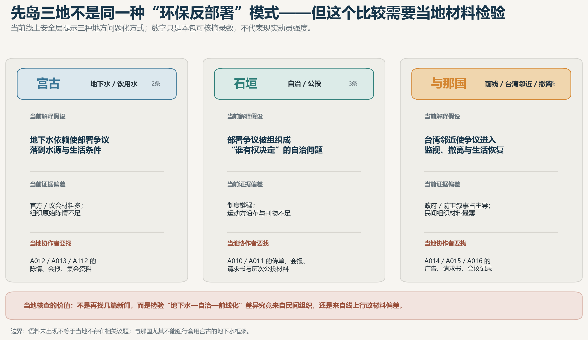
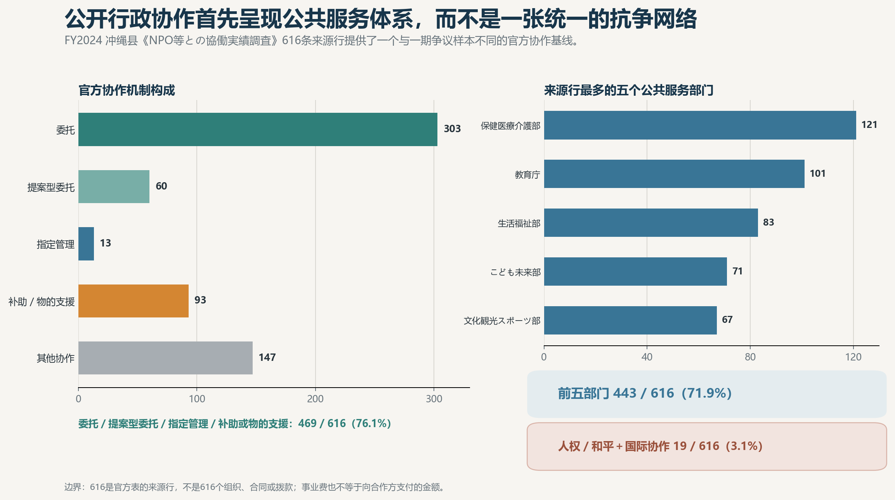

# 复归后冲绳民间组织 / NGO 分类与议题网络 ——第三次进度同步

第二次同步以后，这一轮把重心从"继续扩表"转到"回答问题"上。线上材料和各研究模块的底稿已经齐了，项目第一次能拿出几条经得起复核的解释性发现。这次同步先交代进展，再主动更正上一次的四个提法，然后讲五条发现，最后说清当地核查要解决什么。

## 本轮主要进展

做了三件事。

第一，组织样本按证据门槛从 118 补到 122，达到方案 120 的下限。新增的四个组织（宫古岛地下水研究会、宜野湾ちゅら水会、全港湾冲绳地方本部、新日本妇人会冲绳县本部）都经过逐一人工审核；收它们不是为了凑数，而是各自补上了此前解释不了的一块：宫古的地下水监测与市政交涉、普天间周边的 PFAS 居民自查、港口罢工这类劳工行动、以及女性团体的公投署名动员。

第二，证据核心完成人工核实：法律／政策程序 6 个案件、27 个案件角色全部核完，公投 4 案的程序阶段和角色也已核定。本轮的发现主要建立在这两块上。当前样本共 122 个组织、295 条来源记录。

第三，对第二次同步用过的图和提法做了一轮方法自查，有四处需要更正，这里先说清楚。

## 先更正第二次同步的四个提法

1. **地点 × 议题矩阵已停用重做**。旧图把一个组织名下的所有地点和所有议题直接交叉，没有要求两者出自同一份材料，会夸大"某地有某种框架"的证据。新口径只统计同一份文件里同时出现组织、地点、议题的记录，共 330 条。重画之后图案与旧图方向一致，但每一格都能查回具体文件。
2. **"桥接组织"的范围收窄了**。旧口径按候选关系统计，偏宽。做了逐个来源的删除检验后发现：把 2015 年那份 31 团体联合声明拿掉，"生态—国际"一侧的桥接组织就从 8 个掉到 4 个。真正站得住的是一个小而具名的核心——儒艮保护网络、日本环境法律家联盟、Earthjustice 这一类，它们靠的是诉讼和法律程序，不是泛泛的"人脉连接"。
3. **边野古国际化的说法收紧**。此前容易读成"只有边野古走通了国际化"。准确的说法是：边野古是目前材料最完整、制度入口最多的一个案例；"进入了国际程序"和"国际化成功"是两回事，后者目前的证据不支持。
4. **不再沿用"进度没有落后"**。上一轮按七周表判断"处在第 5–6 周"，现在看过于乐观。实际位置是：线上取材和模块底稿完成，正处在人工定稿、核心图冻结和报告／论文／PPT 成品制作的阶段。

## 发现一：同一个基地问题，三类争议各走各的门路

边野古的新建工程，靠儒艮、珊瑚和环境影响评价这套语言，一路走到日本的评价程序、美国的法院和国际机构；嘉手纳、普天间的老基地，走的是噪音赔偿诉讼，法院认损害、判赔偿；先岛的新部署，则落在地下水、避难、住民投票这些"过日子"和"谁说了算"的问题上。

所以组织在其中起的作用，与其说是把更多团体串成一张网，不如说是转译：把当地的具体困扰，改写成某个制度愿意受理的说法。改写成哪种说法，基本决定了后面能进哪扇门、拿回什么东西。这是本期最想立住的一条解释。

<!-- 建议分页 -->

## 发现二：13 个案例都进了制度的门，没有一个换来项目本身的改变

把材料最全的 13 个案例排成一条链看：公开提出诉求、进入制度场域、留下正式记录，这三步 13 个案例全部走到了；拿到部分结果的有 5 个——噪音案赔了过去的损害，公投形成了条例和投票，泡濑公金诉讼第一波限制了未来支出，儒艮案留下了审查标准和公开记录；但基地、工程或部署本身因此改变的，一个也没有。

这一格的零，比前面几格的全数通过更有分量。制度的姿态可以概括成：承认损害、记录意见、偶尔补偿，但把停工、否决和对行政的约束留在门外。这不是说行动没用——判决、审查标准、公开记录都是下一轮行动的本钱——而是说"进得了制度"和"改得了政策"是两回事，中间那道坎在哪儿、为什么迈不过去，正是二期最值得做的问题。

（这 13 个案例是按"已经进入制度"挑出来的，不能当成功率读。）

<!-- 建议分页 -->

## 发现三：公投不是一锤子买卖，是一串门槛

名护、与那国、2019 县民投票、石垣，四个案子走出四条路。签名够了可以进入投票，也可以在议会被挡下（石垣被挡了两次）；条例可以把投票选项重新设计；投完票，结果怎么用还要看市长、町长、知事各自的处理——名护的咨询性投票没有拴住后面的行政决定，2019 县民投票则把签名一路变成了条例、全县投票和对外通知。

所以公投不能画成"民意进来、政策出去"的直线。它是一道道闸门：放行、改题、拦停、事后重新解释，四种情况都真实发生过。石垣签名过了门槛却始终没能投票，是这套机制最清楚的反例。

<!-- 建议分页 -->

## 发现四：宫古问水，石垣问谁做主，与那国问真打起来怎么办——目前当假设

三个岛面对的都是新部署，说法却不一样。宫古全岛吃地下水，争议就落在水源和生活条件上；石垣靠签名、公投和诉讼，把部署变成"这件事该谁决定"的自治问题；与那国离台湾最近，谈的是前线化、岛外避难和生活怎么恢复。

但这一条现在只能当假设写。三地的线上材料大半出自政府、议会和防卫机构，民间组织自己的陈情、会报、传单在网上很少。所以当地核查的头号任务不是多找几篇报道，而是验证这个三分格局到底是当地组织自己的表达，还是材料保存方式造成的假象。

<!-- 建议分页 -->

## 发现五：行政日常打交道的民间组织，和基地议题基本是两个世界

县政府 2024 年度的 NPO 协作调查共 616 条记录：委托、指定管理、补助这几类机制占约 76%；医疗介护、教育、生活福祉、儿童、文化观光五个部门占约 72%；和平、人权加国际合作，合起来只有 3.1%。

这个 3.1% 是一条有用的基线：本项目盯着的抗争、倡议、法律组织，只是冲绳民间组织世界里很小的一角；行政协作、社区服务、军属慈善各有各的生态，也没有证据把它们连成一张网。最终报告会分层呈现，不画"冲绳 NGO 总网络"。

## 口径

保守口径和前两次一样，不变：共同署名只写共同行动，不写联盟；进了程序不写政策效果；候选关系不当结论。另外正文数字分两层标注——组织—议题关系目前逐条人工核实的是 59 条，约占四分之一；严格口径的地点记录 330 条中核实 67 条。报告和论文的主论证只用核实层，候选层放附录说明。

## 下一步与当地核查

线上不再撒网扩搜，只围绕上面几条发现收紧案例。当地协作者优先补三类材料，标准只有一条：拿回来会改变结论。

1. 宫古、石垣、与那国民间组织自己的一手材料——陈情书、会报、传单、意见广告、请求书、会议记录，用来检验发现四的三分格局；
2. 与那国 2015 年公投的正式结果表、条例修正和町议会记录，以及两个实行委员会的身份与存续；
3. 若最终报告保留"复归后"的长时段标题，需补 1972–2012 年的地方报刊和组织沿革；补不齐就收缩标题，不硬撑。

材料的验收标准已写入正式任务书。取到材料后最先检验的不是"还有没有更多组织"，而是发现一到发现四是否仍然成立。
