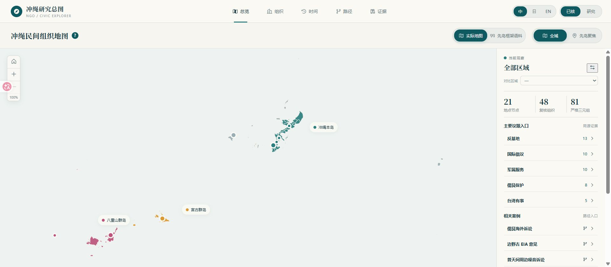
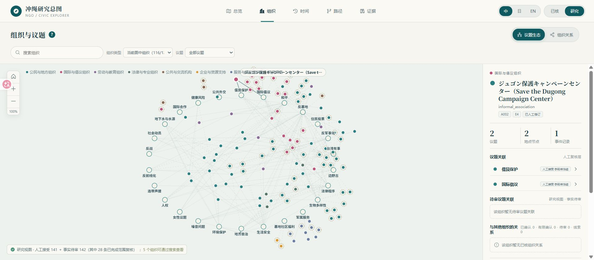
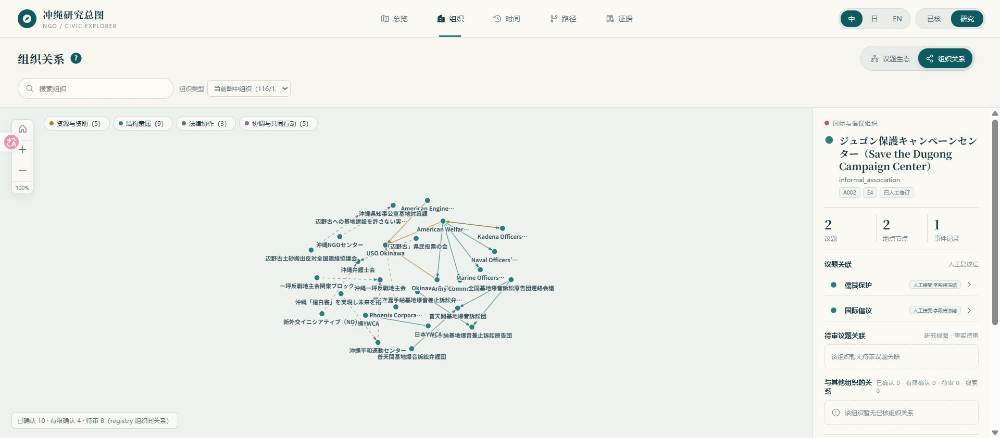
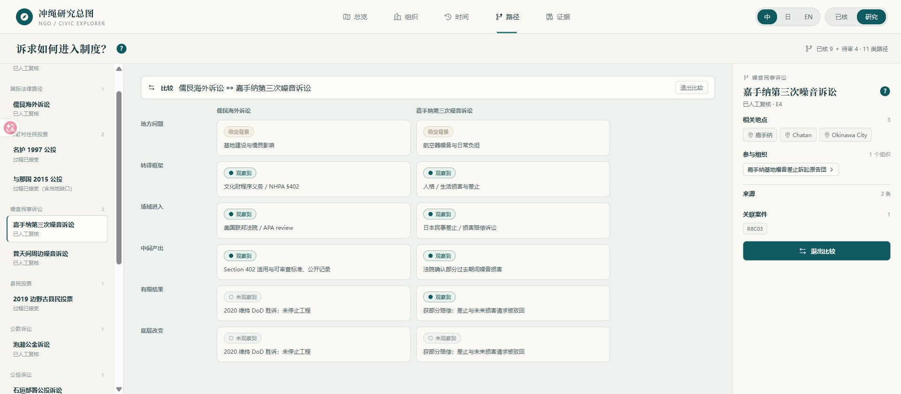
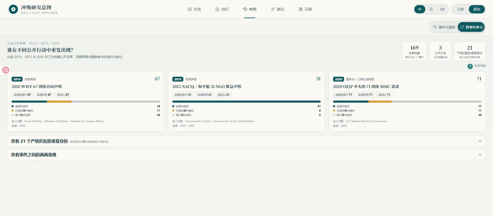
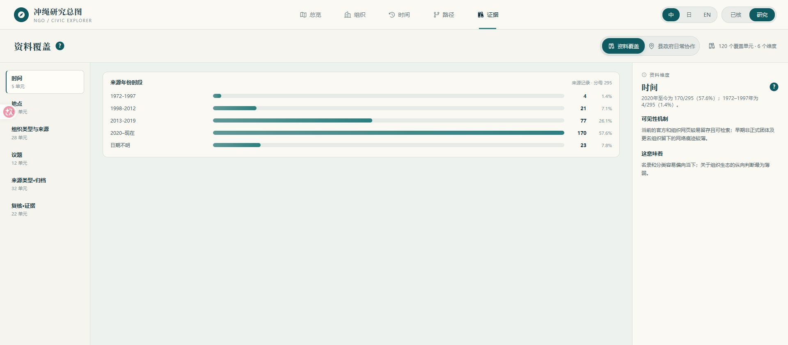
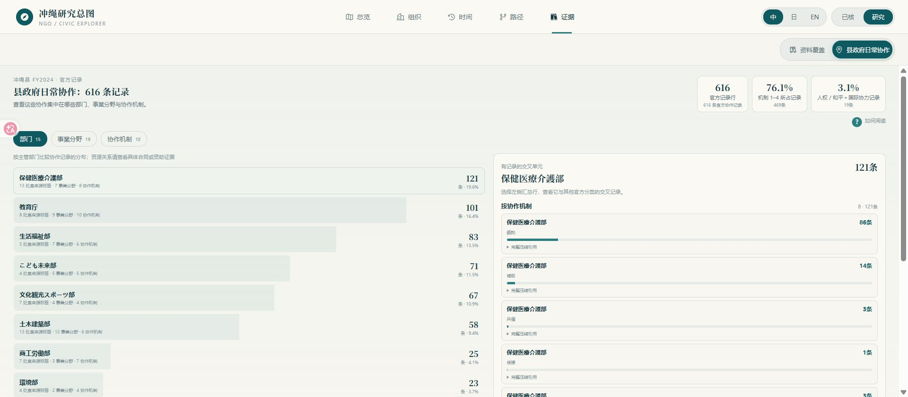

# 复归后冲绳民间组织 / NGO 分类与议题网络——第三次进度同步

目前已经把线上资料、人工复核和研究模块接到一个可以自主探索的网站中。项目的重心也从继续扩表，转到比较案例、检查证据和选择论文问题。

## 主要进展：

当前共整理出 **122 条组织历史记录、121 个有效组织、295 条来源记录、26 类议题和 21 个地点／场域节点**。其中 275 条来源已经完成本地归档。

关系和事件方面，目前有：

| 数据 | 当前数量 | 说明 |
|---|---:|---|
| 组织—议题关系 | 283 条 | 141 条已人工复核，142 条保留在研究层 |
| 组织—地点关系 | 130 条 | 53 条已人工复核，77 条保留在研究层 |
| 同一份材料中的组织—地点—议题记录 | 306 条 | 81 条两侧关系都已人工复核，97 条还能连到具体事件 |
| 组织—事件—场域记录 | 67 条 | 63 条已核，4 条为分析种子 |
| 资助／支援／隶属／法律等关系样本 | 43 条 | 不同关系分开编码，不再混成一张网 |
| 三份公开行动名单 | 169 条参与观察 | 21 个身份在至少两份名单中重复出现 |
| 法律／政策程序 | 6 案、27 个角色 | 全部完成人工复核 |
| 四个公投案例 | 29 个已接受阶段、29 个已接受角色 | 当地材料缺口另列 |
| 制度转译比较 | 13 个案例 | 9 个已核，4 个事件仍待审 |
| 县政府 NPO 日常协作 | 616 条官方记录 | 覆盖 15 个部门、19 个事業分野、10 种机制 |

具体数字、口径和来源索引见：[current_metrics_v3.csv](data/current_metrics_v3.csv)。当前已经没有未处理的线上人工决定，剩余 12 项是当地或新一手材料任务。

按一期方案验收，数据底座、线上复核和展示系统已经基本形成；正式研究报告、论文和汇报 PPT 还没有交付。综合进度约 **70%–75%**。

## 可视化网站：从看图改成自己查

网站访问地址：**[部署完成后补入公司域名]**

网站不是把旧图搬到网页上。现在可以从地图、组织、时间、路径和证据五个入口，自己选择区域、组织或案例，再下钻到关系、事件和来源。

### 1. 先从实际地图认识研究范围

总览页把冲绳本岛、宫古群岛和八重山群岛放在真实位置上。选择区域后，可以查看当地已经核实的组织、议题和案例；也可以直接从宫古、石垣、与那国进入先岛专题。这里的地点—议题数据只统计同一份材料里同时出现的组织、地点和议题，不再使用上一次同步中的宽矩阵。

### 2. 已核和研究分开，但都可以看

“已核”只显示人工确认的 141 条组织—议题关系；“研究”再加入 142 条候选关系。点击任何组织，可以看到它连到哪些议题、地点和事件，并继续打开来源。这样既不把候选材料当结论，也不把尚未复核但有研究价值的线索藏起来。

### 3. 不再把所有连线都叫网络

组织间关系分成资源与资助、结构隶属、法律协作、协调与共同行动四类。已确认、有限确认和待审也分开显示。共同署名只进入事件记录，不会自动变成联盟；资助机会也不会被写成实际拨款。

### 4. 可以把不同制度入口并排比较

路径页把一个案例拆成地方问题、转译框架、进入场域、中间产出、有限结果和底层改变。上图把儒艮海外诉讼与嘉手纳第三次噪音诉讼并排：前者留下审查标准和公开记录，后者取得部分赔偿；两者都没有改变工程或基地运行。用户可以更换案例，不需要只接受报告预先选好的结论。

### 5. 共同出现和稳定关系分开

2010、2015、2020 三份完整名单共有 169 条参与观察，其中 21 个身份在至少两份名单中重复出现。网站同时列出名录内组织、已核事件身份和只在单次名单出现的名称。它能显示公开行动中较稳定的重复骨架，也保留事件性外围，但不会把重复署名直接写成组织联盟。

### 6. 网站同时展示自己看不见什么

295 条来源中，2020 年以来有 170 条，占 57.6%；1972–1997 年只有 4 条，占 1.4%。证据页把时间、地点、组织类型、议题、来源和复核状态六类偏差单独列出。网站上的“中心”首先是公开资料中的可见中心，不能直接当成现实影响力。

## 目前最值得继续做的论文方向

### 方向一：从选举地理推进到组织基础

前期课程论文已经发现，2014–2022 年反边野古选票更符合“什么类型的地方”，而不是当地有多少基地用地；2018 知事选举与 2019 县民投票在市町村层面的相关约为 0.86。但它还没有解释，这种空间差异背后是否有不同的组织、行动和制度入口。

现在的 306 条同源组织—地点—议题记录、67 条事件—场域记录和实际地图，可以把选举结果与当地公开组织基础接起来。下一步不是简单做“组织越多、反基地票越高”的相关，而是比较本岛无基地市町村、名护、宜野湾和先岛各自通过什么组织、什么场域持续生产议题。既有研究已经讨论了冲绳反基地运动中的环境、女性与反军事化框架，也讨论了地方认同和跨地域参与；本项目可以把这些个案解释转换成可比较的地点—组织—事件结构。参见 [Spencer 2003](https://doi.org/10.1080/1037139032000129676)、[Takahashi 2019](https://doi.org/10.5130/pjmis.v16i1-2.6520)。

### 方向二：制度入口不同，得到的结果上限也不同

9 个已核案例全部进入了制度场域并留下中间产出，其中 5 个取得有限结果；底层工程、部署或基地运行方面，8 个没有观察到改变，泡濑案跨两轮呈现混合结果。这个发现比“NGO 会转译议题”再往前一步：真正要比较的是，法律、环评、公投和行政渠道分别允许什么结果，又在哪一步把诉求截断。

法律动员研究一直强调，要区分法律框架、正式机制的调用和社会改变；反基地运动研究也指出，运动可能拖慢、扰动或局部改变军事化，但结果并不等于基地关闭。本项目的新增方法是把不同渠道放在同一条六阶段链上，并允许用户在网站中逐案替换比较。参见 [Lehoucq & Taylor 2020](https://doi.org/10.1017/lsi.2019.59)、[Vine 2019](https://doi.org/10.1086/701042)。

### 方向三：公开行动由少数重复骨架和大量事件性外围共同构成

三份名单中只有 21 个身份完成了跨事件严格匹配，另外 83 条 event-only 名称记录不作跨事件合并。当前材料更像“少数重复参与者＋随事件重新组合的外围”，而不是一张稳定联盟网。

跨国反基地研究已经用扩散、尺度转换和经纪来解释网络形成，社会运动网络研究也提醒，短暂同场不足以证明协作关系。本项目可以继续用事件二部图、严格身份匹配和组织谱系，研究哪些主体负责跨事件承载，哪些实行委员会和连络会随议题生灭。参见 [Yeo 2009](https://doi.org/10.1111/j.1468-2478.2009.00547.x)、[Saunders 2007](https://doi.org/10.1080/14742830701777769)。

### 方向四：行政日常协作与基地倡议处在不同制度通道

冲绳县 2024 年度的 616 条 NPO 协作记录中，机制 1–4 占 76.1%；医疗介护、教育、生活福祉、儿童、文化观光五个部门占 71.9%；人权、和平与国际协力合计只有 3.1%。这说明本项目关注的基地倡议组织，并不是县政府日常接触民间组织的主体。

日本市民社会研究长期强调，国家会通过法律、财政和政策入口塑造不同类型的组织。我们可以在冲绳具体比较“行政协作生态”和“基地争议生态”的组织类型、资源机制和公开场域，而不是把所有 NPO 画成一个总体网络。参见 [Pekkanen 2003](https://doi.org/10.1017/CBO9780511550195.007)、[Musgrave-Takeda 2025](https://doi.org/10.1515/9789048570300-015)。

### 方向五：“再次成为战场”可能正在成为先岛部署的新共同语言

当前已核关系中，“防止前线化”有 3 条，“台湾有事”有 5 条，“反战”有 5 条，并出现了ノーモア沖縄戦 命どぅ宝の会、沖縄を再び戦場にさせない県民の会等新组织和跨议题活动。但这些数字只是当前编码结果，不能直接证明词汇在增长，也不能证明全冲绳已经形成统一运动。

近年的研究已经把“台湾有事”、战争记忆和日本社会对战争威胁的理解联系起来，也直接记录了冲绳“再次成为战场”的担忧。本项目若继续做，新增之处应是追踪这套语言是否被既有环保、女性、人权、污染和自治组织独立采用，是否跨宫古、石垣、与那国重复出现，并同时保留没有采用这套语言的负案例。参见 [Hiyane & Piao 2023](https://doi.org/10.1111/pafo.12224)、[Jobin, Sonoda & Hirai 2026](https://doi.org/10.1177/00380261261423731)。

## 方法上的一个新问题：网络中心可能也是资料中心

当前来源高度偏向近年，且删除 2015 年一份 31 团体声明后，生态—国际一侧的可见桥接组织会从 8 个降到 4 个。网站因此不再把节点度数直接解释成影响力，而把已核／候选、来源下钻和覆盖偏差一起展示。

这个方向可以做成报告的方法章节：比较组织删除与来源删除的不同影响，说明哪些结构由多份独立材料支持，哪些结构依赖单一高承载名单。它接得上网页档案研究对“遗漏、沉默和不平等可见性”的讨论，但目前不能进一步说“资料能力制造了中心性”或“资料少的组织寿命更短”。参见 [Hegarty 2022](https://doi.org/10.37683/asa.v50.10209)。

## 下一步：

1. 完成网站部署，用本次同步让甲方直接进入地图、组织、路径和证据页面探索；
2. 在上述五个方向中选出论文主线，优先补能改变结论的案例和反例，不再无目标扩组织数量；
3. 完成 25–35 页研究报告、8,000–12,000 字论文和 15–20 页汇报 PPT；
4. 当地协作者优先补先岛三地的陈情书、会报、传单、意见广告、町市议会记录，以及 1972–2012 年组织沿革和地方报刊材料。

本轮同步先交网站和可复核的研究方向。下一轮再交正式报告和论文的结构，不把候选关系和当地材料缺口提前写成结论。
