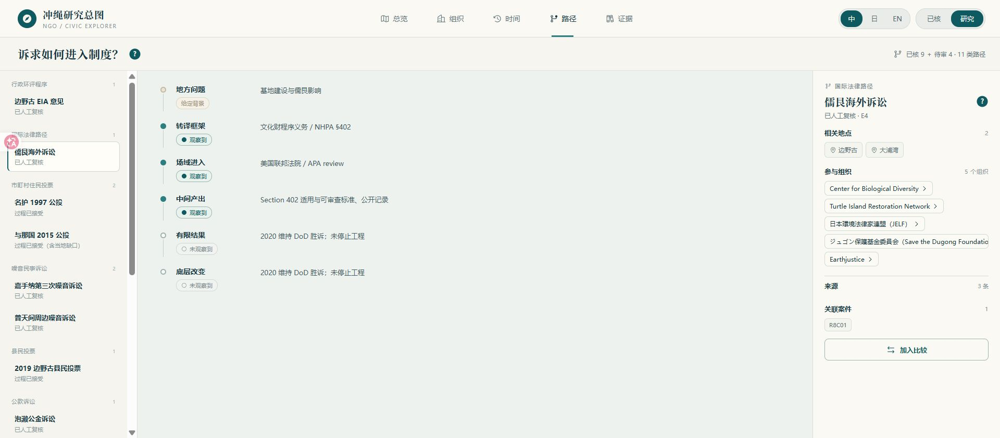
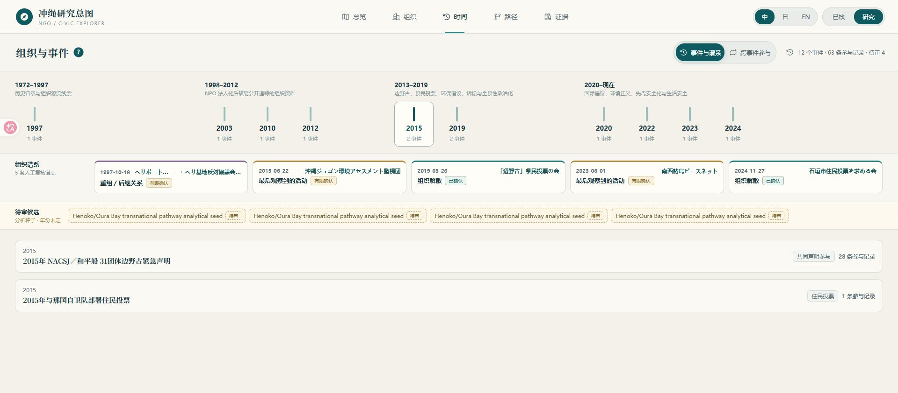

# 复归后冲绳民间组织 / NGO 分类与议题网络——第三次进度同步

目前已经把数据底座、人工复核和研究模块推进成一个可以公开访问的研究网站。项目重心从继续扩表，转向比较案例、核实证据和选择论文问题。

## 项目进展

**http://ngo.laiqi.club/**

以上网站是项目可访问的公开展示页，支持中日英三语，本轮核心成果都在里面。

我们可以从多个入口观察整体情况，再选择更细致的区域、组织或案例，一路查到它具体的关系、事件和证据来源。每条已核关系都能从页面下钻回原始材料；295 条来源中 275 条已经完成本地归档，防止链接失效。

当前共整理出 **122 条组织历史记录、121 个有效组织、295 条来源记录、26 类议题和 21 个地点／场域节点**。有效组织已过一期方案 120 个的下限，其中 116 个已有议题关联。

关系和事件方面，目前有：

| 数据 | 当前数量 | 说明 |
|---|---:|---|
| 组织—议题关系 | 283 条 | 141 条已逐条人工复核，142 条保留在研究层 |
| 组织—地点关系 | 130 条 | 53 条已人工复核，77 条保留在研究层 |
| 同一材料中的组织—地点—议题记录 | 306 条 | 81 条两侧关系都已人工复核，97 条能连到具体事件 |
| 组织—事件—场域记录 | 67 条 | 63 条已核，4 条为分析种子 |
| 资助／支援／隶属／法律等关系样本 | 43 条 | 不同关系类型分开编码，不混成一张网 |
| 三份公开行动名单 | 169 条参与观察 | 21 个身份在至少两份名单中重复出现 |
| 法律／政策程序 | 6 案、27 个角色 | 全部完成人工复核 |
| 四个公投案例 | 29 个已接受阶段、29 个已接受角色 | 当地材料缺口另列 |
| 制度转译比较 | 13 个案例 | 9 个已核，4 个事件仍待审 |
| 县政府 NPO 日常协作 | 616 条官方记录 | 覆盖 15 个部门、19 个事業分野、10 种机制 |

具体数字、口径和来源索引见：[current_metrics_v3.csv](data/current_metrics_v3.csv)。线上人工复核任务已经全部完成，剩余 12 项是当地或新一手材料任务。

既定范围内，大部分冲绳线上公开资料已吸收完毕，更具体的资料覆盖统计可从网站证据页查看。页面上不导出数据包，本轮的数据和证据见附件：[研究数据与证据附件 v1](复归后冲绳民间组织_NGO_第三次同步_研究数据与证据附件_v1.zip)（含当前数据表、网站冻结数据、295 条来源索引、49 条证据笔记、80 份官方／法院／议会一手材料归档和 SHA-256 校验值，文件说明见[附件 README](附件_研究数据与证据_v1_README.md)）。

按一期方案验收，数据底座、线上复核和展示系统已经基本形成；正式研究报告、论文和汇报 PPT 还没有交付。综合进度约 **70%–75%**。

研究重心已向论文问题转变。

### 对第二次同步的几处口径修订

第二次同步后完成了全模块线上审计和证据冻结，有几处旧表述需要主动修订：

- 旧的地点 × 议题矩阵是把组织的全部地点和全部议题做宽投影，不能作为正式结论，已退役；正式数据改用"同一份材料中同时出现"的组织—地点—议题记录（上表 306 条）；
- 组织—议题网络不再作为一张整图展示，分成已核和研究两层，候选关系不写成结论；
- 边野古／大浦湾国际化改述为"当前证据最强的跨尺度转译案例"，程序进入和政策效果分开表述；
- 工期不再沿用"七周计划第 5–6 周"的旧判断，当前处于方法整改、人工冻结和最终成品生产阶段。

以下展示和数字均为修正后的口径。

## 已有成果解读

### 1. 实际地图

总览页（见开头图）把冲绳本岛、宫古群岛和八重山群岛放在真实地理位置上。选择区域后，可以查看当地已核实的组织、议题和案例，也可以直接从宫古、石垣、与那国进入先岛专题。

发现：先岛三地的公开议题结构与本岛明显不同。当前记录中，与那国的组织议题集中在前线化、住民投票、地方自治和生活安全，而不是本岛边野古一线的"儒艮＋环境＋法律"框架。地点维度只统计同一材料中同时出现的组织、地点和议题，不做宽投影。

### 2. 已核和研究视图

"已核"只显示通过逐条事实核查的 141 条组织—议题关系；"研究"会再加入 142 条暂未找到充足证据的候选关系。点击任何组织，可以看到它连到哪些议题、地点和事件，并继续打开来源。

发现：已核层中最稳固的跨议题桥接集中在边野古／儒艮一线，且都有具体机制——Earthjustice 的诉讼代理、Okinawa Environmental Justice Project 的国际提交、Pro Natura 的国际自然保护程序。也就是说，环保、法律、国际倡议三类议题的对接是靠诉讼和环境程序等有名有姓的机制完成的，不是靠"共同出现"堆出来的。

### 3. 组织间的关系视图

组织间关系分成资源与资助、结构隶属、法律协作、协调与共同行动四类；已确认 10 条、有限确认 4 条、候选 8 条分开显示，缺额和边界直接标在图上。共同署名只记为事件参与，不自动算成联盟；资助机会不写成实际拨款。

发现：能严格确认的组织间直接关系目前很少，大部分"网络感"其实来自事件中的共同参与。这个区别本身就是论文要处理的问题（见方向三）。

### 4. 制度入口及比较视图

路径页把一个案例拆成地方问题、转译框架、进入场域、中间产出、有限结果、底层改变六个阶段。上图把儒艮海外诉讼与嘉手纳第三次噪音诉讼并排：前者留下审查标准和公开记录，后者取得部分赔偿；两者都没有改变工程或基地运行。可以自行更换案例，不必只接受报告预先选好的对照。

发现：9 个已核案例全部进入了制度场域并留下中间产出，其中 5 个取得有限结果；但底层工程、部署或基地运行方面，8 例未观察到改变，1 例混合。制度入口决定结果上限（见方向二）。

### 5. 三份公开名单的共同行动

2010、2015、2020 三份完整公开名单共 169 条参与观察，其中 21 个身份在至少两份名单中重复出现。网站同时列出名录内组织、已核事件身份和只在单次名单出现的名称，重复参与不直接写成组织联盟。

发现：边野古公开行动的参与结构是"少数重复骨架＋大量随事件重组的外围"，而不是一张稳定的联盟网。

### 6. 资料覆盖偏差，网站自己也展示

295 条来源中，2020 年以来 170 条（57.6%），1972–1997 年只有 4 条（1.4%）。证据页把时间、地点、组织类型、议题、来源和复核状态六类偏差单独列出。

发现：网站上的"中心组织"首先是公开资料中的可见中心。删除 2015 年一份 31 团体声明后，生态—国际一侧的可见桥接组织会从 8 个降到 4 个。网络结构对单一高承载来源的依赖，在网站上可以直接检查，不需要相信我们的说法。

## 发现与论文方向

### 方向一：从选举地理到组织基础——为什么没基地的市町村最反边野古

前期课程论文已经发现，2014–2022 年反边野古选票更符合"什么类型的地方"，而不是当地有多少基地用地：基地面积模型的解释力只有 R²=0.064，地方类型模型达到 R²=0.563；2018 知事选举与 2019 县民投票在市町村层面的相关约 0.86。但它没有解释这种空间差异背后是什么组织和制度机制。

现在的 306 条同源组织—地点—议题记录和 67 条事件—场域记录，可以把选举结果接到当地公开组织基础上：比较本岛无基地市町村、名护、宜野湾和先岛，各自通过什么组织、什么场域持续生产议题。既有研究讨论过冲绳运动中的环境、女性与反军事化框架和地方认同，但多是个案解释；本项目可以把个案转换成可比较的地点—组织—事件结构。参见 [Spencer 2003](https://doi.org/10.1080/1037139032000129676)、[Takahashi 2019](https://doi.org/10.5130/pjmis.v16i1-2.6520)。

### 方向二：制度入口不同，结果上限不同

9 个已核案例全部进入制度场域并留下中间产出，5 个取得有限结果；底层改变方面 8 例未观察到、1 例混合。这比"NGO 会把议题转译到制度场域"再往前一步：真正值得比较的是，法律、环评、公投和行政渠道分别允许什么结果，又在哪一步把诉求截断。

法律动员研究一直强调区分法律框架、正式机制的调用和实际社会改变；反基地运动研究也指出，运动可能拖慢或局部改变军事化，但结果不等于基地关闭。本项目的新增方法是把不同渠道放在同一条六阶段链上比较，并允许在网站中逐案替换。参见 [Lehoucq & Taylor 2020](https://doi.org/10.1017/lsi.2019.59)、[Vine 2019](https://doi.org/10.1086/701042)。

### 方向三：公开行动由少数重复骨架和大量事件性外围构成

三份名单中只有 21 个身份完成跨事件严格匹配，另外 83 个名称只在单次名单出现。当前材料更像"少数重复参与者＋随事件重新组合的外围"，而不是一张稳定联盟网。

跨国反基地研究已经用扩散、尺度转换和经纪来解释网络形成；社会运动网络研究也提醒，短暂同场不足以证明协作关系。本项目可以继续用事件二部图、严格身份匹配和组织谱系，研究哪些主体负责跨事件承载，哪些执行委员会和连络会随议题生灭。参见 [Yeo 2009](https://doi.org/10.1111/j.1468-2478.2009.00547.x)、[Saunders 2007](https://doi.org/10.1080/14742830701777769)。

### 方向四：基地倡议组织不在县政府日常协作的主通道里

冲绳县 2024 年度的 616 条 NPO 协作记录中，机制 1–4 占 76.1%；医疗介护、教育、生活福祉、儿童、文化观光五个部门占 71.9%；人权、和平与国际协力合计只有 3.1%。本项目关注的基地倡议组织，并不是县政府日常接触民间组织的主体。

日本市民社会研究长期强调，国家会通过法律、财政和政策入口塑造不同类型的组织。我们可以在冲绳具体比较"行政协作生态"和"基地争议生态"的组织类型、资源机制和公开场域，而不是把所有 NPO 画成一个总体网络。参见 [Pekkanen 2003](https://doi.org/10.1017/CBO9780511550195.007)、[Musgrave-Takeda 2025](https://doi.org/10.1515/9789048570300-015)。

### 方向五："再次成为战场"可能成为先岛部署的新共同语言

当前已核关系中，"防止前线化"有 3 条，"台湾有事"有 5 条，"反战"有 5 条，并出现了ノーモア沖縄戦 命どぅ宝の会、沖縄を再び戦場にさせない県民の会等新组织和跨议题活动。但这些数字只是当前编码结果，不能直接证明这套语言正在扩散。

近年研究已经把"台湾有事"、战争记忆和日本社会对战争威胁的理解联系起来，也直接记录了冲绳"再次成为战场"的担忧。本项目若继续做，新增之处是追踪这套语言是否被既有环保、女性、人权、污染和自治组织独立采用，是否跨宫古、石垣、与那国重复出现，并同时保留没有采用这套语言的负案例。参见 [Hiyane & Piao 2023](https://doi.org/10.1111/pafo.12224)、[Jobin, Sonoda & Hirai 2026](https://doi.org/10.1177/00380261261423731)。

## 目前规划

1. 在上述五个方向中选出论文主线，优先补能改变结论的案例和负案例，不再无目标扩组织数量；
2. 完成 25–35 页研究报告、8,000–12,000 字论文和 15–20 页汇报 PPT；报告附方法章节，说明哪些结构由多份独立材料支持、哪些依赖单一高承载来源；
3. 当地协作者优先补先岛三地的陈情书、会报、传单、意见广告、町市议会记录，以及 1972–2012 年组织沿革和地方报刊材料；
4. 网站随证据冻结持续更新，任何时候都可以从任一组织页面下钻到来源核验。

本轮同步先交网站和可复核的研究方向，下一轮交正式报告和论文的结构。候选关系和当地材料缺口不提前写成结论。
