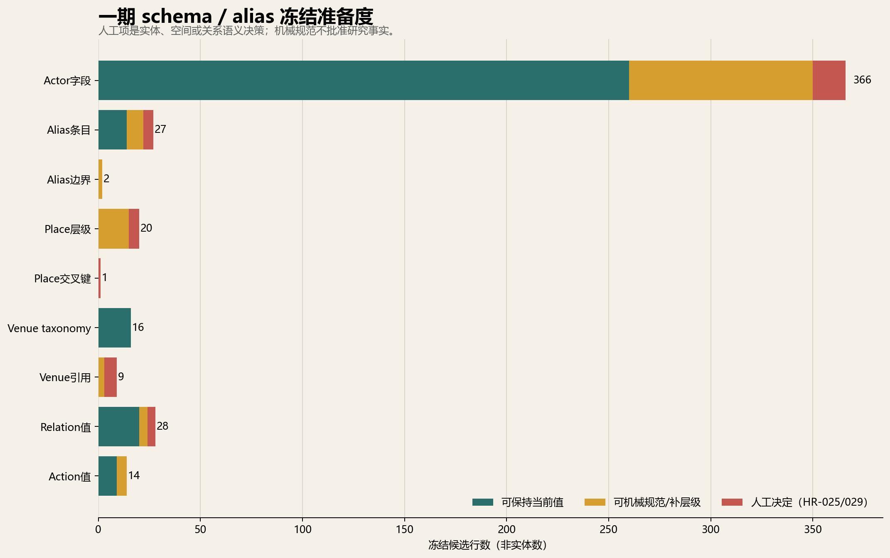
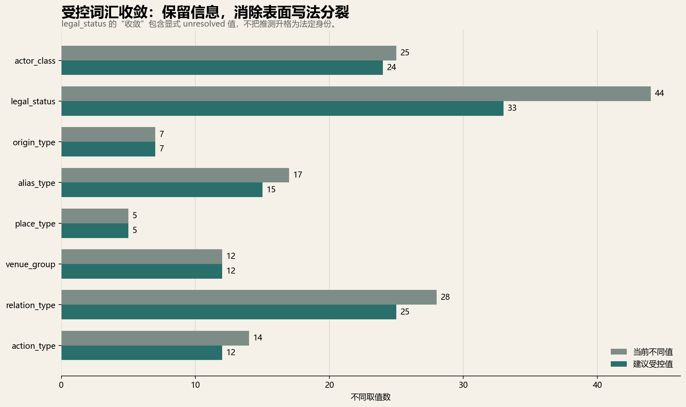

# Schema／alias／空间字段冻结审计 brief v1

日期：2026-07-13

状态：**冻结前候选包；没有修改中央 schema、registry、alias、place、venue 或关系表。**

## 1. 结论先行

当前 registry 的 122 个 actor，其 `actor_class`、`legal_status_guess`、`origin_type` 共 **366 个字段单元（N×3）**已逐项覆盖。HR-027 若新增／移除 actor，必须先完成受控合并再重生本包，新增 actor 会自动进入三字段审计。当前共有 **483 条统一候选**，其中 **36 条进入 HR-029**；人工字段按稳定 review item ID 保留，当前已填写 0 条、待处理 36 条。

`origin_type` 的 7 个值已闭合，可原样冻结。`actor_class` 从 25 个表面值收敛为 24 个建议值；A087–A093、A095–A101仍只是身份级合并，14 个 actor 的 class assignment 继续人工决定。`legal_status_guess` 从 44 种表面写法收敛到 33 个受控值；无法确认法人格者明确落到 `*_unresolved`，而不是猜成 NPO、基金会或正式网络。

## 2. Alias：查找等价不等于实体等价

现有 27 条 alias、15 种 alias_type 全部入审计。没有发现跨 actor 的规范化 alias 冲突；有 1 组同一 actor 的标点差异（X016 的 spouses' / spouses），因税务记录与组织写法来源不同可保留。

三类名称必须和普通 alias 分开：

- A010 的「石垣島への自衛隊配備を止める住民の会」是 predecessor label，不是 A010 的简单旧名；
- A052 第4次嘉手纳、A053 第2次普天间是 case-round label，不表示每轮成员完全相同；
- A105 日本YWCA 与 A107 冲绳YWCA 是全国／地域两个 actor，以 affiliation 连接，不互作 alias，也不转移行动角色。

A106 的「首都圏連絡会／首都圏キャンペーン」canonical 选择仍需 HR-029。A111 的「女団協」不得转成已剔除 A094 所关联的「沖女連」，也不得借 alias 把 A094 重新放回 registry。

## 3. Place 与 venue：一处跨键冲突，九处不能一键替换

20 个 place 都获得 parent 与查询 alias 候选。P004 Futenma 与 P010 MCAS Futenma必须分别代表议题／地域层与实体基地层；P005 Kadena 需明确是 Kadena Air Base；P011–P013 的与那国、石垣、宫古必须区分町／市与岛屿／区域写法。这五项进入 HR-029。

135 条 actor–place 边发现 **1 个交叉键冲突**：AP123 的 `place_id=P006` 指向 Camp Schwab，而 `place_name=Camp Foster`。本包将其显式标为 `defer_to_HR025`／needs-human；HR-025 是唯一权威语义闸门，schema 包不另建 HR-029，也不静默建议 P007。

16 项 venue taxonomy 的 ID 与 label/group 本身无重复；但 event/pathway 表有 **9 条 `R10_VENUE` 占位引用**。其中 USO 的三条服务／捐赠观察可机械候选为 V016；伞状 membership 未必需要 venue，JICA活动与公共外交 opportunity 也不是同一种场域，所以 6 条进入 HR-029。V015 已实际使用 1 次，其“future expansion”旧 note 已过时，但本包不改 note。

## 4. Relation / action 受控值

`relation_type` 覆盖 78 行、28 个当前值，建议收敛为 25 个受控值。关键边界：

- `duplicate_replaced_by_F022` 是被拒绝重复记录，不应继续作为 relation type；
- `co_presence_lead` 只能候选为 co-presence observation，不能写成 coordination；
- `aggregate_history` 是金额历史观察，不是可分配给具体 recipient 的普通关系；
- `grant_opportunity` 保持 opportunity，不能升级为 grant 或 recipient；
- joint in-kind contribution 保留“共同贡献、份额未拆”的边界。

`action_type` 覆盖 255 行、14 个当前值，建议收敛为 12 个受控值。`co_signing` 与 `joint_statement`统一为事件参与；两种 request-letter 写法统一为 submission participation；`pathway_role`改为显式 analytical seed。共同署名、请求或同场出现仍不是稳定联盟。

## 5. 冻结后的可写与不可写

完成 HR-029 并由主线程另行合并后，可以写：本项目使用闭合 actor/origin/legal-status/alias/place/venue/relation/action 词汇；前身、诉讼轮次、全国—地方组织和空间层级各有显式边界；每个关系与行动值可以被 lint。

仍不可写：名称相似即同一组织；前身与后继是简单改名；不同诉讼轮次成员相同；全国组织行动自动转移到地方组织；`R10_VENUE` 九条可统一替换；NOFO 是已拨款；共同参与是稳定联盟。Schema freeze 也不批准任何候选 actor、edge、funding 或选举角色。

## 6. 后续顺序

1. 先完成 HR-027 的 registry 价值判断与受控合并；
2. 重生本 schema 包，确认合并后的每个 actor 都进入 N×3 字段审计；
3. 完成 `HR029_schema_alias_freeze_review_v0.csv`，再由主线程受控合并 class assignment、alias lineage、place/venue 与 relation 语义；
4. AP123 仅由 HR-025 决定；处理 `R10_VENUE` 后运行全库 FK/lint；
5. 再生成五类核心图、研究报告、论文和 PPT。

复现命令：`python scripts/make_schema_alias_freeze_v1.py`。
